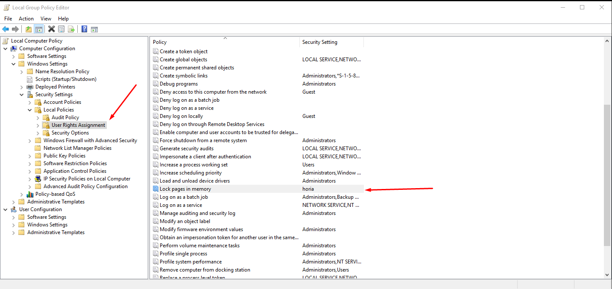

# Frequently Asked Questions

## TurtleCoind / zedwallet Issues<a name="tcoind-zedwallet-issues"></a>

#### Q: I'm seeing an error in TurtleCoind `Proof of work too weak for block...` and the syncing stopped.

This occurs because of the blockchain forking, generally when one mining pool has a very large hashrate.

This can be fixed by re-syncing the correct blockchain from scratch. See [here](#q-how-can-i-re-sync-the-blockchain).

#### Q: I'm getting a "corrupted blockchain" error like this?

```
2018-May-07 15:52:19.877323 INFO    initializing core
2018-May-07 15:52:19.908530 INFO    Importing blocks from blockchain storage
2018-May-07 15:52:19.908530 ERROR   Corrupted blockchain. Block with index 428973 and hash aafa7fd33d476535188bdd9e86ba51bb5e058be8e52367b78e9c0c03e74299c5 has previous block hash 2c0cf6c07612b9e1ea19c6922a56746b83cb42c7b11edfc4b185572225bb0f20, but parent has hash 26189359b64d4bb357a04b102a42a01d2771a3f3d80db3ca1b7395a2aeaede4a. Resynchronize your daemon please.
2018-May-07 15:52:19.924135 INFO    Closing DB.
```

Re-sync your daemon from scratch(see below question)

#### Q: How can I re-sync the blockchain?

Close any TurtleCoin-related software, then go to `%APPDATA%`, and delete the `TurtleCoin` folder.  
Reopen TurtleCoind/the GUI wallet and let it re-sync.

Alternatively, check [this guide](Using-checkpoints) for instructions on how to use checkpoints for a quicker sync, or try a [remote node](Using-remote-nodes)

#### Q: When I open TurtleCoind on a Mac, I get an error `Illegal instruction: 4`. How can I fix it?

This is a known issue with older macs or un-updated macs.

Try entering this into a terminal -

```
curl -sL "https://raw.githubusercontent.com/turtlecoin/turtlecoin/master/multi_installer.sh" | bash
```

This automated script should compile the software itself, and place the binaries in ./src once done.

#### Q: Why are my results being rejected from the pool?

 A: You're using a incorrect algorithm. If you are using XMR-Stak, you should use `turtlecoin` as the algorithm, if you are using XMRig use `cryptonight-lite` as the algorithm and have the variant set to 1.

#### Q: I got banned from my mining pool. Why?

A: If you submit lots of invalid shares, a pool might ban you. Possible reasons for invalid shares can be

* your hardware getting overworked,

* high ping to the pool,

* or your difficulty being set too low.

Try lowering any overclocks, choosing a pool closer to you or setting a higher difficulty port.


#### Q: I've opened the wallet, and I'm getting lots of red messages like "It looks like TurtleCoind isn't open!"...

```
It looks like TurtleCoind isn't open!

Ensure TurtleCoind is open and has finished initializing.
If it's still not working, try restarting TurtleCoind. The daemon sometimes gets
stuck.
Alternatively, perhaps TurtleCoind can't communicate with any peers.

The wallet can't function until it can communicate with the network.
```

You need to also open up `TurtleCoind.exe` and let it sync. TurtleCoind is your connection to the network, and needs to be open and synced whenever you want to use your wallet.

#### Q: I've opened the wallet, and I'm getting lots of messages like "Your TurtleCoind isn't fully synced yet!"..

```
Until you are fully synced, you won't be able to send transactions, and your balance may be missing or incorrect!
```

Your daemon hasn't finished syncing yet. Keep zedwallet open, and wait until you are 0 days behind the current block, and for the daemon to print out a green message saying `Successfully synchronized with the TurtleCoin Network.`  
You can also type `status` in the daemon and press enter to see the current height it's at.

#### Q: I think I should have more money in my balance than it is showing, what should I do?

Re-sync your daemon from scratch(see [here](#q-how-can-i-re-sync-the-blockchain)), sync [using checkpoints](Using-checkpoints) or use a [remote node](Using-remote-nodes)) if you're using the GUI wallet.
If it still doesn't work, then [update](http://latest.turtlecoin.lol) your wallet!

#### Q: I've tried resetting, but it isn't working. What should I do?


* In zedwallet, type `export_keys`, and save the view and spend key somewhere safe in case something goes wrong, if you haven't already.

*  Then, close and reopen zedwallet and TurtleCoind.
*  Type `reset` in zedwallet after reopening your wallet file.
*  It should start resetting your wallet, but the progress might not be immediately obvious - wait a while, and it should start counting up the blocks and printing out your transactions as it gets to them.

#### Q: How do I backup my wallet?


Open zedwallet and type `export_keys`.  
Save the view and spend key somewhere safe, and you can use them to reimport your wallet if you lose it.

#### Q: My transactions are very slow

Try attemping a fusion transaction:

* Open up zedwallet, and type `optimize`, then press enter.
* It will confirm if you want to optimize your wallet; it will take a bit. If you're fine with that, type `Y` and press enter again.

Your wallet is now being optimized. When it finishes, your transaction should be able to send

#### Q: How do I send TRTL?


You can check [this out](Using-zedwallet#tx-trtl) for steps on how to send TRTL to someone.

#### Q: How do I send money to exchanges / use payment ID?


You can check [this out](Using-zedwallet#tx-trtl-p-id) for steps on how to send TRTL with the payment ID.

#### Q: What is mixin?


Mixin is how many times your transaction is "mixed" with others for obfuscation and privacy.  
Mixin is locked by the network to `7` as of block `620,000` and is not adjustable by the user; this is done to ensure that no one can send a non-private transaction(`0` mixin) or be a victim of the "Tall Poppy Syndrome" by using a high mixin compared to everyone else on the network.

#### Q: How can I view my balance?


If `TurtleCoind.exe` is fully synced, in zedwallet, simply type `balance`.

#### Q: How long does it take to sync TurtleCoind.exe?


Currently it takes a couple of hours. This number will increase as more people use TRTL and the blockchain gets larger. If you'd like to speed up the process, check out the question below.

#### Q: Can I speed up the syncing of the blockchain?


You can sync [with checkpoints](Using-checkpoints) (only with zedwallet) or use a [remote node](Using-remote-nodes)

#### Q: Can I skip the syncing?


Yes, you can currently use a remote node with zedwallet, Nest wallet and WalletShell. The keys stay on your PC, so it's secure. Check [this guide](Using-remote-nodes) for more information. [Checkpoints](Using-checkpoints) are also an option if you're using zedwallet.

#### Q: What does it mean if my balance is locked?


This is a transfer which hasn't been confirmed by the network yet. It will move into your main balance shortly, generally after 3 minutes.

#### Q: In zedwallet.exe, I get an error `Error: failed to save new wallet: boost::filesystem::unique__path: Keyset as registered is invalid`. How can I fix it?


This is caused by some broken Windows crypto keys. In the address bar in Windows Explorer, type `%AppData%/Microsoft/Crypto/RSA/`.

There should be a folder in there, with a long name, like `S-1-5-21-1416222650-108526586-4052533318-1000`.

Go into this folder and delete the files in there. Then reboot, and try again.

## Mining

### General mining questions<a name="mining-questions"></a>

#### Q: How do I get started mining?


You can check [this guide](Mining)

#### Q: I'm using a Mac, can I still mine?


Yes, of course! We're working on a guide.

#### Q: I've started mining, how can I view my stats?


Visit your pool's homepage. There should be a spot for you to put in your TRTL address, and you can then view your hashrate, pending balance, payouts, and more.

#### Q: Why is the hashrate on the pool website different to what is shown in my miner?


The values will always be slightly different as it is an estimate, but if there is a large difference, it is likely you have just started mining.

Your hashrate is calculated over time, and so it will slowly go up to the correct level.

#### Q: I've been mining for a while, but my pending balance hasn't gone up?<a name="pending-balance-not-gone-up"></a>


On your pool website, check the time that the last block was found on your pool, and the average time to find a block.

Your stats will only update when your pool finds a block and it matures, so if your pool doesn't find blocks very often, you will have slower updating stats.

#### Q: I've been mining, but the balance in my wallet hasn't gone up?


To save money on fees, the pools send payouts in chunks. [Check your pool website for your pending balance](#pending-balance-not-gone-up).

#### Q: Why are my results being rejected from the pool?


You're using a incorrect algorithm. If you are using XMR-Stak, you should use `turtlecoin` as the algorithm, if you are using XMRig use `cryptonight-lite` as the algorithm and have the variant set to 1.

#### Q: I got banned from my mining pool. Why?


If you submit lots of invalid shares, a pool might ban you. Possible reasons for invalid shares can be

* your hardware getting overworked,

* high ping to the pool,

* or your difficulty being set too low.

Try lowering any overclocks, choosing a pool closer to you or setting a higher difficulty port.

You should get unbanned after approximately 20 minutes. This is a good time to setup some backup pools!

#### Q: Should I set up multiple pools?


Yes, in case you get banned, or a pool goes down for some time, you can keep mining. A good amount to have would be at least three.

#### Q: Where can I find a list of pools?


[Here](Pools) is a list. It also has other nifty stats like the pool's fee, minimum payout and server location.

#### Q: What does "pool weight" mean in XMR-Stak?


Pool weight determines what order pools are used in case another is unavailable.

Higher weighted pools are used first.

If all pools are the same weight, they will be used in the top to bottom order that they are listed in the `config.txt` file.

#### Q: What pool should I choose?


There are a few factors to consider when choosing a pool.

* One is your ping, you can find this out by pinging the server in a command prompt by typing `ping example.org`, where `example.org` is the pool address.

* Another is the hashrate of the pool. If you go on the pool's website, you can see how often they find blocks.

  If the pool takes a long time to find a block, your stats will take a long time to update.

* Finally, the minimum payouts can be significant if you're a small miner.

  This is the amount you need to mine before you get paid. Most pools will list this under the "Payments" tab.

  You can check [this list](Pools) of pools. It specifies each pool's minimum payout as well as server location.

#### Q: How many hashes per second is good for my hardware?


<http://monerobenchmarks.info/> is a good source for this. You can look up your [CPU](http://monerobenchmarks.info/searchCPU.php) and [GPU](http://monerobenchmarks.info/searchGPU.php).

#### Q: I can't get the miner working, is there an easier way to mine?


You can try the web miner [here](http://turtleminers.club/pages/webmine/). You will get a lower hashrate than native mining, and it doesn't have GPU support, however it's very easy to setup.

Alternatively, you can hop onto the [Discord][Discord_Link] if you're having issues and we'll help you out.

#### Q: What is the miner executable / why isn't it working?


This is a solo miner, which is CPU only. This means to gain any TRTL, you have to find a block by yourself, which unless you have many powerful CPUs, is very unlikely.   

We strongly recommend using a pool, and a miner such as XMR-Stak or XMRig.   

Nevertheless, if you want to try it out, open a command prompt in the same directory, and run

```
./miner --address TRTL...
```

replacing `TRTL...` with your full TRTL address.

You need to have `TurtleCoind` open and synced to use this miner, unlike conventional miners, where the pool hosts the daemon.

#### Q: Is there a calculator to see how much TRTL I'll mine per day?


Your pool's homepage should have one - enter your hashrate and it'll give an estimate of how much TRTL you'll mine per day.  
If there isn't, you can check one [here](https://turtle.land/#pools).

### XMR-Stak Issues

#### Q: How do I view my hashrate in XMR-Stak?


Press `h` in the XMR-Stak window.

#### Q: My PC is laggy when I'm mining in XMR-Stak. Can I fix this?


This could be caused by multiple issues:

* If you're using a Nvidia card, open up `nvidia.txt`, in the same directory as `XMR-Stak.exe`. Try setting `bfactor` to `8` and `bsleep` to `100`, and then reload your miner after saving the file.

  If it's still laggy, try increasing both values slightly. This will cause you to get less hashes per second, but can let you use your PC more effectively. You can try tweaking the value to increase your hashrate.

  Some people also achieve success by lowering the thread count.

* If you're using an AMD card, lower the value of `intensity` in `amd.txt`.

* If you're using just a CPU, you can delete the cores being used from `cpu.txt`.


#### Q: How can I use just my GPU or CPU to mine in XMR-Stak?


If you're using XMR-Stak, you can start the miner with a certain command. Check [this out](XMR-Stak-Guide#to-start-xmr-stak-without-using-your-cpugpu-follow-these-steps--) for more info.

#### Q: XMR-Stak is crashing on startup, with an error about CUDA. What am I doing wrong?


If you are using a nVidia card, try opening `nvidia.txt` in the same directory as `XMR-Stak.exe`, and lowering the value of `threads` until it stops crashing.

#### Q: I get a socket error when connecting to a pool in XMR-Stak. What am I doing wrong?


Generally, this is due to an incorrectly configured config. In the directory where `XMR-Stak.exe` is, there should be a file called `config.txt`.

Open this up, and check that it looks **similar** to this:

```
{"pool_address" : "eu.turtlepool.space:3333",
"wallet_address" : "TRTLv2Fyavy8CXG8BPEbNeCHFZ1fuDCYCZ3vW5H5LXN4K2M2MHUpTENip9bbavpHvvPwb4NDkBWrNgURAd5DB38FHXWZyoBh4wW",
"pool_password" : "x",
"use_nicehash" : false,
"use_tls" : false,
"tls_fingerprint" : "",
"pool_weight" : 10 },
```

  Your wallet address is the address starting with `TRTL`, not your wallet filename.

  This error can also occur if the pool is having issues - try another pool and see if the error continues.

Some users have experienced issues with their firewall or antivirus as well however, so perhaps try disabling these if you are experiencing this issue.

#### Q: Can I lower the 2% fee taken by XMR-Stak?


This is possible, however please note that these developers are independent from the TurtleCoin project and are doing some great work, so we would suggest leaving it as is.

If you do wish to change/remove the dev fee, you will have to compile XMR-Stak yourself, they have instructions to do this on their [GitHub](https://github.com/fireice-uk/xmr-stak/blob/master/doc/compile.md)

Once you have downloaded the code, you need to change the file `donate-level.hpp` in the `XMR-Stak/XMR-Stak/` folder.

#### Q: I'm getting an error in XMR-Stak: `MEMORY ALLOC FAILED: VirtualAlloc failed. Reboot might help`


This is nothing to worry about, and is because XMR-Stak failed to set up largepages.

This can slightly raise your hash rate, and XMR-Stak attempts to set it up, but it needs a reboot to apply, so reboot your PC.


If a reboot doesn't help, then press `Win` + `R` to open up the run box, then type `gpedit.msc` and press enter(you may require admin permissions)

Navigate to the directory shown in the image, and ensure `Lock pages in memory` is turned on for your user account(`horia`, in this case, is a user account).




#### Q: I'm missing the file `vcruntime140.dll`. Where can I get this?


Try installing this: <https://www.microsoft.com/en-us/download/details.aspx?id=52685>

#### Q: When I run XMR-Stak I get an error: "The application was unable to start correctly (0x000007b)"


Try installing this: <https://go.microsoft.com/fwlink/?LinkId=746572>

## Paper Wallet / Cold Storage?<a name="paper-wallet-cold-storage"></a>

#### Q: Wait, what's Cold Storage?


The term "cold storage" refers to a wallet that has been created via an offline means.

The preferred way to do this is via a computer than has never ever been connected to the internet, commonly referred to as an air gapped device.


Why is this a thing? If done properly it means it is near impossible for the keys to be secretly intercepted since the data is never viewable by other compute devices.

You see above/elsewhere wallet files are being created via the wallet software, these files might be stored unencrypted, if unencrypted then the keys can be read by malicious software and balances of those wallets, transferred.

Thus to protect against that scenario you could transfer any TRTL balance to one of these cold storage addresses. Please remember to keep secure/secret backups of your keys. If you lose the keys you lose any balance that was transferred to that wallet.

#### Q: Can I make a paper wallet?


Yes, you can view the guide [here](Making-a-paper-wallet)

#### Q: I made a paper wallet, how do I use it?


You can check out [this guide](recovering-your-wallet) for steps on how to import your paper wallet into a wallet of your choice(choose a wallet and import the keys).

#### Q: Can I view the balance of my wallet online?

  A: Due to TurtleCoin being a cryptonote-based coin(private), this is not possible.

It should be possible in the future to allow users to give away just their Private View Key to view transactions, but this hasn't been implemented by anyone so far, and would allow that website to see every transaction that you make.

## Other
#### Q: Why does TRTL have such a high amount of tokens/small amount of decimal places?


Read a great post about the justification for it [here](https://medium.com/@turtlecoin/one-trillion-turtles-coin-supply-and-unit-economics-5bfbea0aa1f1).

#### Q: How can I get some TRTL?


There are multiple ways to acquire TRTL, for example:

* Mining - see [here](Mining)
* Buying - TRTL is currently available on these exchanges: [TradeOgre](https://tradeogre.com/exchange/BTC-TRTL) and [TradeSatoshi](https://tradesatoshi.com/Exchange/?market=TRTL_BTC)
* Bounties - Bounties for developing TRTL software, spreading the word of TRTL, and many other things are often posted in the #bounties channel on [Discord][Discord_Link]. Check the pinned messages for current bounties.
* Tips - Turtles with often tip each other, especially if you make spicy memes in the `#memes` channel
* Faucet - Head over to the faucets-
  * [madk's faucet](https://faucet.trtl.me/) - 10 TRTL, thrice a day
  * [polar-it's faucet](https://turtlecoin-faucet.xhub.cloud/) - 20 TRTL, every 120 minutes
  * [fipsi's faucet](https://trtlfaucet.de.cool/) - 100 TRTL, after every 500 turtles use it

  and enter your TRTL address.  
  The amount you can receive is limited to share the TRTL for all. Thanks to @madk, @polar-it and @fipsi for creating them.

#### Q: Is there a web wallet?


Yes, we have a few. You can learn more about them in [this guide](Using-a-Web-Wallet).


#### Q: Are there any light wallets / mobile wallets?


None are ready for usage right now, but they are being worked on. Check the development channels in [Discord][Discord_Link] to see how people are getting on, and feel free to join in if you're a programmer!

#### Q: What happend to RainBorg/Raindance?

  A: They were both discontinued due to them being gamed and exploited. RIP.

#### Q: How do I register my wallet on Discord?

  A: You can check out this guide [here](Using-trtlbot-plus-plus#registering-your-wallet).

#### Q: Where is the blockchain stored?


On Windows, it is in `%APPDATA%/turtlecoin`. On Mac and Linux, it is in `~/.turtlecoin`.

#### Q: Is there a blockchain explorer?


Yes, the offical one is

* https://explorer.turtlecoin.lol

although there are currently a few other unique ones-  

* http://trtl.rocks

#### Q: How do I make sure a pool isn't forked? 


You can type in `/forked` in the `#bots` channel in the [Discord][Discord_Link] server, which will return with a list of pools which are possibly forked.

#### Q: I have a question which wasn't answered here, what should I do?


[Join the Discord server][Discord_Link], and come to the `#help` channel, we'll try and fix any issues.

[Discord_Link]:http://chat.turtlecoin.lol/
