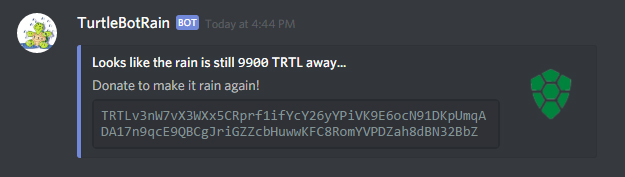

# How to Participate in raindance

This guide will walk you through the process.

## raindance

A raindance can happen when the TurtleBotRain wallet has acumulated 10,000 turtles.

When TurtleBotRain posts in the raindance channel:

A raindance is about to begin!

When you see this message Rain Dance will begin soon. 
Get you TRTL wallet address ready.

**wait** and especially **don't click on and reactions or emotes yet. This will cause a disqualification!**

Wait for the “Quick, send me your wallet” message.

Click on TurtleBotRain to send your address as a PM to TurtleBotRain 

You should recieve a PM back that looks like something like this:

or

**Emoji will be different for everyone**

If you did everything correct you are included in the payout! Congrats!

## !rain

If you type !rain **in the bots channel only** you should get a response back with how many turtles are needed for a raindance.

-dylz
**TRTLv16L6zSUVFWutFJ7jfDJp5ZbLL5UzCfEPAczJeSodTG8Q7ZJeNFVab1dTL1eztEVcavf6frfnPhGHaZrwDfagJ1Eq4dt5ew**
