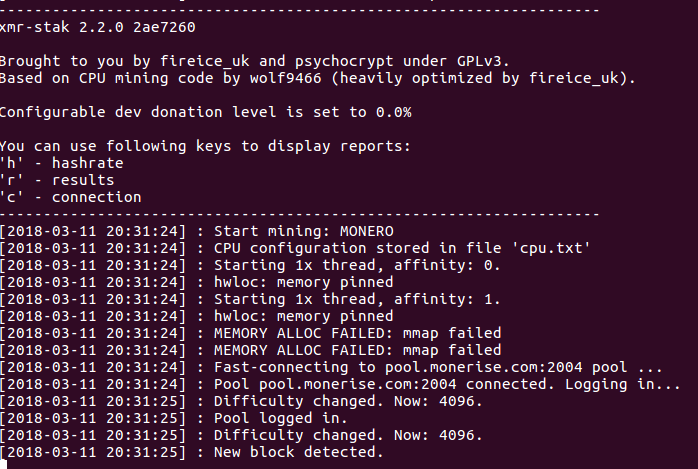

# How to Mine TurtleCoin with Google Cloud Platform (GCP) 

## Get started with GCP

See:  https://cloud.google.com/compute/docs/quickstart-linux

## Mining Instructions For Debian Linux on GCP

SSH into the GCP instance and follow these steps-

*Guide sponsored by [Monerise](https://monerise.com)*

1. Open the terminal and install dependencies by running this command- 

   ```sudo apt install libmicrohttpd-dev libssl-dev cmake build-essential libhwloc-dev```

2. Clone the package- 

   `git clone https://github.com/turtlecoin/trtl-stak.git`

3. To remove donations, type-

   `gedit xmr-stak/xmrstak/donate-level.hpp`

- Change-

  ```
  `constexpr double fDevDonationLevel = 2.0 / 100.0;`
  ```

- to

  ```
  `constexpr double fDevDonationLevel = 0.0 / 100.0;`
  ```

1. Make a directory- 

   `mkdir xmr-stak/build`

2. Move over there-  

   `cd xmr-stak/build`

3. Run cmake-

   `cmake .. -DCUDA_ENABLE=OFF -DOpenCL_ENABLE=OFF`

4.  Finish building it-

   `make install`

5. XMR-Stak will now be located in `/home/user/xmr-stak/build/bin`

6. In the terminal, type- (install if not installed)-

   `ccmake ..`

7. Using the Up and Down arrows, scroll to the 2nd page. Then, on `XMR-STAK_CURRENCY`, press enter to change it to `monero` (if needed, you can make personal tweaks by reading the descriptions of each value)

8. Once you're done, press `c` and then `g` on your keyboard. 

9. Type- 

   `./xmr-stak`

10. Check [XMR-Stak Setup and Configuration](#xmr-stak-setup-and-configuration)

11. If you see something like this, that means it’s working!



## XMR-Stak Setup and Configuration

Upon first launching TRTL-Stak, the software will ask you several setup and configuration questions.

1. `Please enter: - Do you want to use the HTTP interface? Unlike the screen display, browser interface is not affected by the GPU lag. If you don't want to use it, please enter 0, otherwise enter port number that the miner should listen on`

Enter `0`, if you are like most people, and do not need to remotely check your hashrate.

If you do need to, then enter a port number. 
Let's take the port number as `0101` and your IP address as `26.24.105.14` as an example.

To check the hashrate, enter in the address bar of your web browser, `<26.24.105.14>:<0101>`. It should show a page with your rig's hashrate.
If you are checking from the same IP address, you can alternatively enter, `localhost:<0101>`

Make sure to enter your own IP address if you enable this feature. You can choose any port you want!

2. ```
   Please enter: Please enter the currency you want to mine:

      - aeon7
      - cryptonight
      - cryptonight_lite
      - edollar
      - electroneum
      - graft
      - intense
      - karbo
      - monero7
      - stellite
      - sumokoin
      - turtlecoin
   ```

​        Enter `turtlecoin`

3. `- Pool address: e.g. pool.example.com:3333 `

Choose a pool from any of the [available pools](Pools) that is **closest to you** and enter its URL (you will be able to add more later).

4. `- Username (Wallet address or pool login):`  

If you have not yet downloaded and ran the TurtleCoin core software to sync the blockchain and create a wallet, you can make a [paper wallet](Making-a-Paper-Wallet) to start mining towards now, and import the wallet later.

5. `- Password (mostly empty or x):`  

Enter `x`.

6. `- Rig identifier for pool-side statistics (needs pool support). Can be empty:`

Leave it empty and press enter.

7. `- Does this pool port support TLS/SSL? Use no if unknown. (y/N)`  

In most cases, `N` is fine.

8. `- Do you want to use nicehash on this pool? (y/n)`  

Enter `n`(in case you do, enter `y`).

9. `- Do you want to use multiple pools? (y/n)`  

- Enter `y` if you would like to add more pools. 
- Give them all a weight of `10` if you're tired of reading, or if you want the best experience, give the pools nearest to you a higher number, and the ones further from you a lower number.  
- TRTL-Stak will prioritize the highest weight pool, and fall back to the others if it cannot connect.
- If they are all given the same weight, it will connect to them in order of how they are listed, form top to bottom, in the configuration file.
- If you are on Windows 7/8, it will ask for administrator permission again. Click `Yes` to grant it permission.
- If you are on Windows 10, it will not ask for it again.

Done! The miner will now start scanning your hardware and will begin mining. Awesome!


TRTL-Stak will save your configuration in `config.txt`  in the same directory from which it was first run. 
Your configuration for pools(algorithm to mine, address, port etc) will be saved in `pools.txt`
The configuration of the device it mines(CPU/AMD/NVIDIA) will be saved in `cpu.txt`, `amd.txt` or `nvidia.txt`, respectively.


Run TRTL-Stak again from the same directory to reuse the configuration.