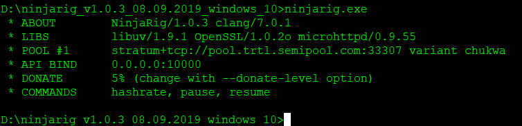

Argon2 CPU & GPU miner for TurtleCoin®

## Downloading and Installing for Windows or Linux

NinjaRig can be downloaded from here:

* [NinjaRig Miner](https://github.com/turtlecoin/ninjarig/releases)

## Downloading and Installing for OS X

Would need to be compiled, instructions don't currently exist...

## NinjaRig Setup and Configuration

1. Unzip the file and extract the files into a new folder (Make sure your anti-virus doesn't delete the files)
2. Open the `config.json` file with Notepad
3. Find and change the following lines:

* `"url: "[pool address]"`
* `"user: "[wallet address]"`

- Instead of `[wallet address]`, simply paste your TurtleCoin wallet's address. Make sure to keep the `"`!
  - If you don't have one yet, you can find out how to create a wallet [here](../wallets/Making-a-Wallet)

- In place of `[pool address]`, you'll need to choose a pool to mine towards. You can learn more about them [here](Pools). Make sure to keep the `"`s!  

4.  Save the file and
  * start `ninjarig.exe` for Windows
  *  or `./ninjarig` for Linux

That's it! You should be mining away now! :)

If you want to read more about the project then head over to the project's [README.md](https://github.com/turtlecoin/ninjarig/blob/master/README.md)

## Troubleshooting

### Start then stops, no errors

If you're getting something like the above screenshot, check your AV software, it might have deleted a bunch of files...