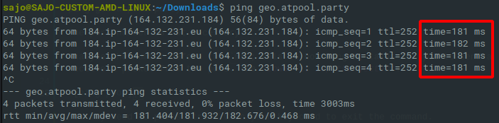

Unless you want to [solo mine](../CPU-Solo-Mining), which is unfeasible for many people, you will need a pool to mine towards. Make sure to choose the one closest to you!

To view a list of pools, check out [the explorer](https://explorer.kryptokrona.se/pools.html)

## Pinging a Pool

The best pool is the one that is closest to you; this can easily be determined by *pinging* the pool through your terminal

Open up your terminal; look for "Command Prompt" or "Terminal" in your Start/Applications menu

When open, enter this command: `ping <pool url>`, replacing `<pool url>` with the address of your pool.

For example, if I was mining at gota.kryptokrona.se, then the pool url (what you put into your miner) is `geo.kryptokrona.se`. Thus, I would enter:
```
ping geo.kryptokrona.se
```
The port number is not necessary

Analyze the number before the `ms`; this is how long it takes for you to send a receive a packet from the pool. The *lower it is, the better*. 

<!--  -->

You may need to press Ctrl + C on your keyboard to exit the command.

## Definition of Fees

Rather simple; the pool operator will take a percentage of the reward of the block found for himself.

Example-

- the fee is 0.1%
- the block reward is 30000 XKR
- 30000 x 0.1% = 30

Therefore, the pool operator will take 30 XKR for himself.


## Definition of Different Types of Methods

These will be found on the pool website; if not specified, it is most likely proportional.

### Proportional (share-based)

A proportional pool carries no risk to the pool operator as miners are simply paid out when a block is found. No blocks, no payout!

With a proportional pool the risk is all on the miners if it takes longer than expected to find a block then the miners earn less. On the flip side, if the pool is lucky (they will all average out the same eventually) the miners get more.

Example-

- A block is found after 100,000 shares
- You submitted 1,000 of those shares (you have 1% of the pool's total hash power)
- There’s 30000 XKR per block

Quite simply you will get 1% of the block = 300 XKR.

Now if the pool has a bad round (a round is the time taken to find a block) and it takes 200,000 shares to find a block (twice as long) and you have submitted 2,000 shares (as you’ve been mining twice as long), you still only get 1% of the block = 300 XKR

This can also work in the miners favor too, as if it takes half the time (50,000 shares) to find a block and you submitted only 500 shares - again 1% - 300 XKR.

Basically, you always get a percentage of the block and you win/lose depending on the “luck” of the pool.

The drawbacks to a proportional pool are that there is often a fee, although some pool operators rely on donations only, and you will have to bear the variance of the block times and luck unlike a PPLNS pool.

Also they are susceptible to “pool hoppers” where PPLNS pools are not.

### PPLNS (Pay Per Last *n* Shares)

PPLNS does not pay out per block found, rather it pays based on the number of shares you last submitted, and helps to dissuade pool hoppers.

How it works is,

* you start mining with a PPLNS pool.
* Rather than paying you out based on the number of shares you submitted since you started mining/the last block was found, it will pay depending on how many shares you submitted in a period of time, called the window, which is an estimate of the time in which the pool in question finds a block.
* So, after you start mining, it will take a few hours for you to earn your normal earnings - and since the effect of pool hoppers is lessened, you may make comparatively more than other methods.

Basically, you get paid based on

- the number of shares you submitted (how good what you're mining with is)
- and how long you have been mining.