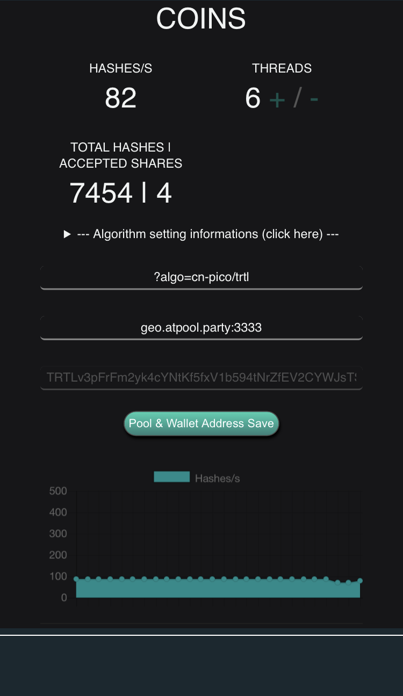

### Please note: Using your mobile to mine TurtleCoin is not effective and should only be done for the lulz. It may also cause the phone to overheat and result in premature silicon degradation, shortening the lifespan of your phone.

## Install and Setup

1. Download the [Crypto Miner](https://itunes.apple.com/us/app/crypto-miner-for-monero-xmr/id1320235885?mt=8) app from the App Store  
2. Upon downloading and installing, open the app  
3. Choose the 2nd last option;
```
Custom Pool Cryptonight | CN-Lite | CN-Fast | CN-Fast2(Half) | CN-Pico
```  
**Do *not* choose `Turtlecoin`**  
4. Set the threads to however many you wish to use using the +/- buttons  
5. In the first field, type `?algo=cn-pico/trtl`  
6. Then, enter a pool of your choice. To learn more info a pool to choose, see [here](Pools). Make sure you include the port number.  
7. Enter your TurtleCoin wallet address  
8. Click `Pool & Wallet Address Save`  
9. Click `Start`  

To stop mining, click `Stop`.

## Expected Results

After clicking `Start`, your `HASHES/S` and `TOTAL HASHES | ACCEPTED SHARES` values should start to increase. Additionally, the graph displaying your hashes/s should start moving.

