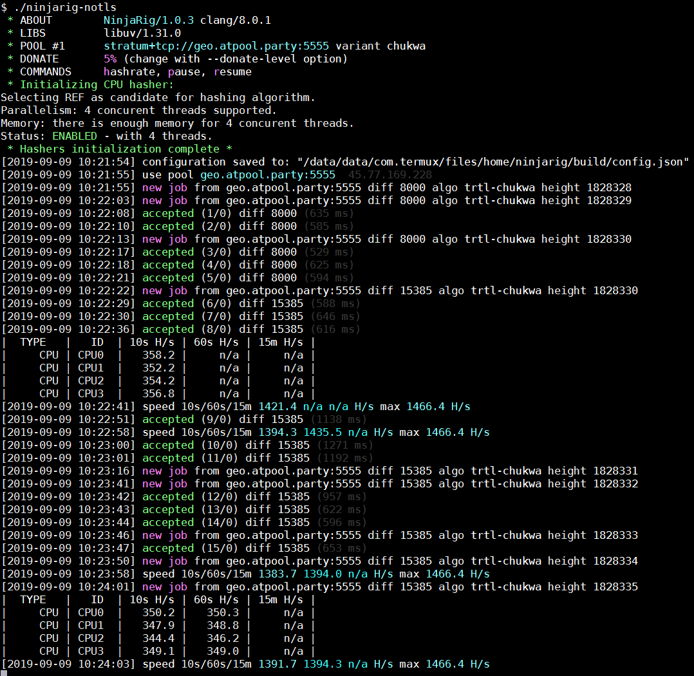

### Please note: Using your mobile to mine TurtleCoin is not effective and should only be done for the lulz. It may also cause the phone to overheat and result in premature silicon degradation, shortening the lifespan of your phone.

## Downloading and Compiling NinjaRig aka TRTLRig aka XMRig

1. Download [Termux](https://termux.com) from the [Play Store](https://play.google.com/store/apps/details?id=com.termux) 
   or from [F-droid](https://f-droid.org/repository/browse/?fdid=com.termux).
2. Upon downloading and installing, open the app.
3. Run `pkg upgrade -y`
4. Run `pkg install git cmake libuv clang nano -y`
5. Run `git clone --single-branch https://github.com/SoreGums/ninjarig`
  - Had to alter the original, hence why pulling from SoreGums' repo instead of primary repo. The part removed doesn't work on Android. All credit for NinjaRig is to be directed to [bogdanadnan](https://github.com/turtlecoin/ninjarig). The change is to do with contacting a server to get new details about donate info. Check the [commit history](https://github.com/SoreGums/ninjarig) if you want to [know exactly](https://github.com/SoreGums/ninjarig/commit/a191cab94687629e535e0fc5d1c9a720a76a1031) what is different, else just clone and go, sheesh - SoreGums
6. Run `cd ninjarig`
7. Run `mkdir build && cd build`
8.  Run `cmake .. -DWITH_HTTPD=OFF -DWITH_TLS=OFF -DWITH_OPENCL=OFF -DWITH_CUDA=OFF -DCMAKE_BUILD_TYPE=Release`
9.  Run `make -j2`
10. Run `cp ../src/config.json config.json`
11. Run `nano config.json` and adjust your config settings to match you wallet and pool etc.
12. [Configure it](#configuring-ninjarig)
13. Run `./ninjarig-notls`
  
---

Alternatively, instead of copy pasting each command individually you can copy paste what is below into termux after you open it. 

```bash
pkg upgrade -y  && \
pkg install git cmake libuv clang nano -y && \
git clone --single-branch https://github.com/SoreGums/ninjarig && \
cd ninjarig && \
mkdir build && cd build && \
cmake .. -DWITH_HTTPD=OFF -DWITH_TLS=OFF -DWITH_OPENCL=OFF -DWITH_CUDA=OFF -DCMAKE_BUILD_TYPE=Release && \
make -j2 && \
cp ../src/config.json config.json && \
nano config.json
```

Then, it'll open the config file where you can [configure it](#configuring-ninjarig).  
After that, you can run `./ninjarig-notls` to run the miner.
  
## Configuring NinjaRig

A few notes:
- to navigate between lines, either use the up/down arrows in the right or swipe on the screen
- `^E` means `CTRL` on the given bar in termux + `E` on the default keyboard
- To edit a line:
  - move your cursor to it
  - press `^E` to navigate to the end of it
  - backspace till where needed and edit appropriately
  - make *sure* you include the *ending quote(`"`)* and *comma(`,`)*. Not doing this will cause your miner to not work

---

1. Find and change the following lines:
   * `"algo: "chuckwa"` should already be set
   * `"url: "[pool address]"` (include the port number)
   * `"user: "[wallet address]"`
   * **be sure to keep the quotes `""` around each field**

2. Press `^X` (`CTRL` + `X`)
3. Press `Y` to confirm your changes
4. Press enter/return (on default keyboard) to save file

Continue with normal steps

## View your hashrate

The miner automatically prints out hashrate ever so often; however, if you'd like to view it at any time, simply press `h`.  
Know that this is the most reliable source of your hashrate; the value displayed on your pool is an estimate and may vary wildly from the truth. 

When possible, refer to the 15m avg.

## Stopping the Miner
In order to stop the miner if ever needed, you can press `^C` (`CTRL` + `C`)  

To restart it, type `./ninja-notls`. Or, press the up arrow and press enter.

You can also use the commands `p` and `r` to pause and the resume the miner, respectively.

## Expected Results

If all goes well, you should see something like this:


