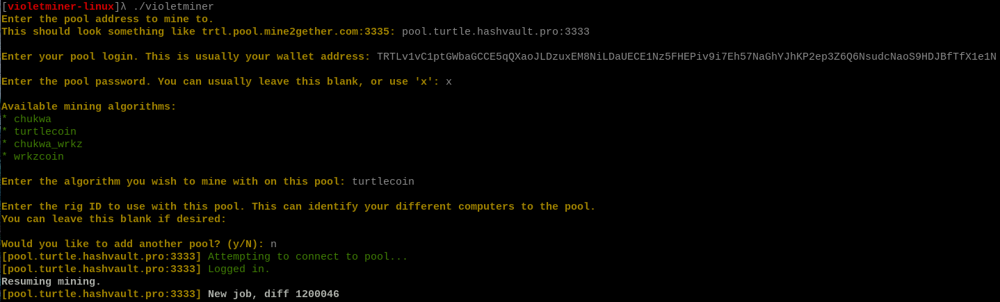

## Downloading and Installing for Windows, Linux, Mac, or ARM

violetminer can be downloaded from its [GitHub Page](https://github.com/turtlecoin/violetminer/releases/latest)


## violetminer Setup and Configuration

1. If on Windows, unzip the file into a new folder. There should be an executable, violetminer.exe, in this folder.
     * If on Linux, Mac, or ARM, untar the file into a new folder. (`tar -xf violetminer-linux.tar.gz` for example).

### Guided Setup



1. Double click / run the violetminer executable.

2. You will be prompted for a mining pool to use. You can learn more about picking a pool [here](Pools). Make sure you include the pool port. You can find this information on most pools 'Getting Started' page.

  * If you're having difficulty copy/pasting into the command window on Windows, you can click in the top left of the window, then select edit, then paste.

3. Next, you need to enter the pool username. For the majority of pools, this is your TurtleCoin address. It should start with `TRTL`. If you need to use something else, this will be listed on your pool page.

4. Next up is the pool password. For most pools, you can just leave this blank, or use `x`. Some pools will use it to allow extra configuration options. Again, check the getting started page for your pool for more information.

5. The next thing to choose is the algorithm. Since you're wanting to mine TurtleCoin, just enter `turtlecoin` here.

6. Finally, we have the rig ID. This can be used if you have multiple computers mining and want to be able to distinguish between them on the pool side. If you don't, just hit the `Enter` key here to leave it blank.

7. You're done! If you want to add another pool, enter `y` on this step. If not, enter `n` and you will start mining if you entered everything correctly!

* If you want to modify your config, it has been written to the file `config.json`, in the directory you launched violetminer from. You can now just double click violetminer, and it will read from the config file.

Want more information on how to modify the config file? Check out [this section](#config-file-explanation).

### Command Line Setup


It is not recommended to use the command line launching, as it is less configurable, but regardless, here's the explanation.

1. The following tables list all the available command line options.

2. Each `Flag` should be followed by the corresponding `Argument`.

3. For example, since `--pool` takes a `String` argument, we should specify it like so: `violetminer --pool trtl.pool.mine2gether.com:3335`.

4. If a flag takes an argument of `None`, that means you just use the flag, with nothing following it. For example, `violetminer --disableCPU`.

#### Mandatory Options

If you use command line launching, you must specify all of the following flags.

| Flag          | Argument | Description                                                    |
| ------------- | -------- | -------------------------------------------------------------- |
| `--algorithm` | String   | The mining algorithm to use. Should be set to `turtlecoin`     |
| `--username`  | String   | The pool username to use. Normally is your TurtleCoin address. |
| `--pool`      | String   | The pool hostname and port, to mine to.                        |

#### Optional Options

| Flag              | Argument | Description                                                                             |
| ----------------- | -------- | --------------------------------------------------------------------------------------- |
| `--help`          | None     | Lists all options and exits                                                             |
| `--version`       | None     | Lists the version of violetminer you are using and exits                                |
| `--config`        | Filepath | Use the config specified instead of the one in `config.json`                            |
| `--threads`       | Number   | The number of CPU threads to use. Defaults to the number of threads your processor has. |
| `--disableCPU`    | None     | Disables CPU mining                                                                     |
| `--disableNVIDIA` | None     | Disables NVIDIA mining                                                                  |
| `--disableAMD`    | None     | Disables AMD mining (Does nothing till AMD support is added)                            |
| `--rigid`         | String   | Specifies a custom rig ID to use with the pool specified                                |


* If the `config` option is specified, any other command line options will be **ignored**.  
* I repeat, **do *not* mix command line options and config files**, use just one or the other.

Example launch command:

```
violetminer --algorithm turtlecoin --pool trtl.pool.mine2gether.com:3335 --username TRTLv2Fyavy8CXG8BPEbNeCHFZ1fuDCYCZ3vW5H5LXN4K2M2MHUpTENip9bbavpHvvPwb4NDkBWrNgURAd5DB38FHXWZyoBh4wW
```

### Config File Explanation

* The config file should be pretty self explanatory, but just in case I'll explain what all the fields do here.

Here's an example config for reference.

```json
{
    "hardwareConfiguration": {
        "cpu": {
            "enabled": true,
            "optimizationMethod": "Auto",
            "threadCount": 12
        },
        "nvidia": {
            "devices": [
                {
                    "desktopLag": 100.0,
                    "enabled": true,
                    "id": 0,
                    "intensity": 50.0,
                    "name": "GeForce GTX 1070"
                }
            ]
        }
    },
    "pools": [
        {
            "agent": "",
            "algorithm": "turtlecoin",
            "host": "trtl.pool.mine2gether.com",
            "niceHash": false,
            "password": "x",
            "port": 2225,
            "priority": 0,
            "rigID": "",
            "ssl": false,
            "username": "TRTLv2Fyavy8CXG8BPEbNeCHFZ1fuDCYCZ3vW5H5LXN4K2M2MHUpTENip9bbavpHvvPwb4NDkBWrNgURAd5DB38FHXWZyoBh4wW"
        },
        {
            "agent": "",
            "algorithm": "turtlecoin",
            "host": "pool.turtle.hashvault.pro",
            "niceHash": true,
            "password": "x",
            "port": 443,
            "priority": 2,
            "rigID": "",
            "ssl": true,
            "username": "TRTLv2Fyavy8CXG8BPEbNeCHFZ1fuDCYCZ3vW5H5LXN4K2M2MHUpTENip9bbavpHvvPwb4NDkBWrNgURAd5DB38FHXWZyoBh4wW"
        },
        {
            "agent": "",
            "algorithm": "wrkz",
            "host": "fastpool.xyz",
            "niceHash": false,
            "password": "x",
            "port": 3005,
            "priority": 1,
            "rigID": "",
            "ssl": false,
            "username": "WrkzjJMM8h9F8kDU59KUdTN8PvZmzu2HchyBG15R4SjLD4EcMg6qVWo3Qeqp4nNhgh1CPL7ixCL1P4MNwNPr5nTw11ma1MMXr7"
        }
    ]
}
```

### `hardwareConfiguration`

This is the section for configuring your GPUs and CPUs.

#### `cpu`

| Key                  | Type      | Description                                                                                                                                                                                                                                                                                              |
| -------------------- | --------- | -------------------------------------------------------------------------------------------------------------------------------------------------------------------------------------------------------------------------------------------------------------------------------------------------------- |
| `enabled`            | `Boolean` | Whether CPU mining is enabled or not.                                                                                                                                                                                                                                                                    |
| `optimizationMethod` | `String`  | Which CPU optimizations to use. Defaults to `Auto`, which should pick the best available. Possible values: `AVX-512`, `AVX-2`, `SSE4.1`, `SSSE3`, `SSE2`, `NEON` `None`, `Auto`. Note that not all optimization methods are available on every CPU - The available ones are printed in green at startup. |
| `threadCount`        | `Integer` | The number of CPU mining threads to launch.                                                                                                                                                                                                                                                              |


#### `nvidia`

##### `devices` - An array of Nvidia GPUs to use.

| Key          | Type      | Description                                                                                                                                                                                                                                                                                                                                                                                                          |
| ------------ | --------- | -------------------------------------------------------------------------------------------------------------------------------------------------------------------------------------------------------------------------------------------------------------------------------------------------------------------------------------------------------------------------------------------------------------------- |
| `desktopLag` | `Float`   | Determines how long we sleep between kernel launches. Should be a value between `0` and `100`. `100` = Maximum desktop lag, maximum performance, no sleeping between launches. `0` = Minimum desktop lag, minimum performance. Decrease this value if your PC is unusable when mining, and also consider adjusting `intensity`. This value can be fractional, so a `desktopLag` of `50.57` for example is just fine. |
| `enabled`    | `Boolean` | Whether mining with this GPU is enabled or not.                                                                                                                                                                                                                                                                                                                                                                      |
| `id`         | `Number`  | The internal id of this GPU. It is recommended you do not alter this value, or it may result in confusing results or errors. This lets you identify which GPU is which.                                                                                                                                                                                                                                              |
| `intensity`  | `Float`   | Determines how much GPU memory and how many GPU threads to launch per iteration. Should be a value between `0` and `100`. `100` = Maximum intensity, maximum GPU memory, maximum GPU threads. `0` = Minimum intensity. This value can be fractional. Lowering intensity doesn't necessarily lower hashrate, and may improve power consumption.                                                                       |
| `name`       | `String`  | The name of the GPU this `id` refers to. It is recommended you do not alter this value, or it may cause confusing results. This lets you identify which GPU is which.                                                                                                                                                                                                                                                |

### `pools`

This is the section for configuring your chosen pools. This value takes an `array`, so you can add multiple pools separated by commas, as you can see in the example config above.

If you specify multiple pools, the pools will be tried in order of their priority, which we'll explain later. If your preferred pool(s) are offline, we will keep trying to reconnect to it while mining on your backup pools.

| Key         | Type      | Description                                                                                                                                                                                                                                                       |
| ----------- | --------- | ----------------------------------------------------------------------------------------------------------------------------------------------------------------------------------------------------------------------------------------------------------------- |
| `agent`     | `String`  | This value lets you specify a custom user agent. Most pools don't use this, but some may allow for extra configuration using this value.                                                                                                                          |
| `algorithm` | `String`  | The algorithm to mine with on this pool. You can specify multiple pools which all have different algorithms, if you like.                                                                                                                                         |
| `host`      | `String`  | The pool host to mine to. Note that this value does *not* include the pool port!                                                                                                                                                                                  |
| `niceHash`  | `Boolean` | Whether to use nicehash style nonces with this pool. Leave this `false` if you're not sure.                                                                                                                                                                       |
| `password`  | `String`  | The password to use with this pool. Most pools will work fine with a blank password, or `x`, but some will use this to login to their pool, or to specify further pool configuration.                                                                             |
| `port`      | `Number`  | The pool port to mine to.                                                                                                                                                                                                                                         |
| `priority`  | `Number`  | The priority of this pool. A lower value indicates a higher priority, so a pool with a priority of `0` will be tried before a pool with a priority of `1`. If we are not connected to the pool with the highest priority, we will keep trying to reconnect to it. |
| `rigID`     | `String`  | Allows you to specify a custom rig ID for the pool. If the pool supports this field, it should allow you to distinguish between each mining rig you have on the same pool, to see the hashrate per rig, for example.                                              |
| `ssl`       | `Boolean` | Whether to use SSL with this pool. Only use this option if the pool says the port you are using is an SSL port.                                                                                                                                                   |
| `username`  | `String`  | The username to use with this pool. Usually is your TurtleCoin address.                                                                                                                                                                                           |

## Notes

* The development fee is 1%. This means it will mine for the developer 1 minute out of every 100 minutes.  
* Found a bug? Can't get something working? Start by visiting the [TurtleCoin discord](http://chat.turtlecoin.lol) and asking in the `#mining` channel, or open an issue on [the repo](https://github.com/turtlecoin/violetminer/issues).  
* Want to compile yourself? Visit [here](https://github.com/turtlecoin/violetminer#compiling) for instructions.  
* Want more info? Visit the [github page](https://github.com/turtlecoin/violetminer).  

Happy mining!
