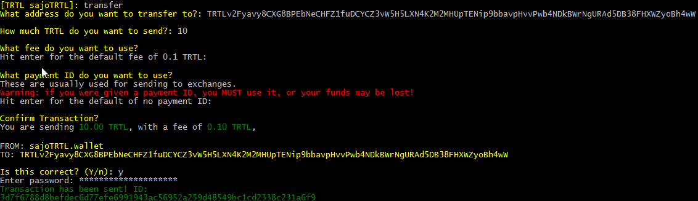

## Downloading

Binary distributions can be found [here](https://github.com/kryptokrona/kryptokrona/releases).

Select the appropriate file for the target platform (Windows, Mac, Linux).

Binaries are provided in `.zip` format, while source code is provided in `.zip` and `.tar.gz` format.

## Installing

### Installing on Windows

Extract the *.zip* file (`kryptokrona-...-windows.zip`).

### Installing on Mac

Extract the *.zip* file:

```bash
unzip kryptokrona-...-mac.zip
```

### Installing on Linux

Extract the *.zip* file:

```bash
unzip kryptokrona-...-linux.zip
```

## Synchronizing the Blockchain

Running `kryptokronad` will start the *kryptokronad* network daemon, which will connect to the network and begin downloading and verifying the kryptokrona blockchain.  

Because the blockchain is constantly growing, the file size always increases (the blockchain is currently over 35 GB), and *kryptokronad must verify every block*, which is both CPU and disk intensive. An SSD with at least this much free disk space is recommended, unless you plan to use [remote nodes](Using-Remote-Nodes). 

### Using Checkpoints

In **versions 0.4.3+** you can sync a fresh chain from block 0 much quicker by using checkpoints. Follow [this guide](Using-Checkpoints) to learn more.

### Windows

Run the `kryptokronad.exe` executable extracted from the Windows binary zip:

### Mac / Linux

Run the `kryptokronad` binary extracted from the `.zip` download:

```bash
./kryptokronad
```

## Using kkrwallet

With `kryptokronad` still running in the background or another terminal/shell/command prompt, open kkrwallet:

#### Windows

Run the `kkrwallet-beta.exe` executable from the extracted folder.

#### Mac / Linux

```bash
./kkrwallet-beta
```

### Using kkrwallet commands

kkrwallet has a twin command system; a numerical shortcut for navigating the menu, and typed commands you can access directly.  The more you use kkrwallet the more typed commands you'll pick up.  This guide is written using the written commnand system.  Feel free to use the numbers associated with the command.

### Creating a Wallet

To create a wallet, type `create` and press `enter`:

```
Welcome, please choose an option below:

 1	open                     Open a wallet already on your system
 2	create                   Create a new wallet
 3	seed_restore             Restore a wallet using a seed phrase of words
 4	key_restore              Restore a wallet using a view and spend key
 5	view_wallet              Import a view only wallet
 6	exit                     Exit the program

What would you like to do?: create
What would you like to call your new wallet?: XKR
Give your new wallet a password: **************
Confirm your new password: **************
Welcome to your new wallet, here is your payment address:
XKRuxqfDys1pfQ1omkHMVViY4sFh6My5Ff3HBY8XPp3cJBkEfD7romVyzKug3mb9NNR4A8kEjZxZ9CHUgWckBSpPfbxnWAQUGL

Please copy your secret keys and mnemonic seed and store them in a secure location: 
Private spend key:
41c834f7c26e12373e5c39a9c9b1f8beb665324ad0d098cabda1234567b5d30f

Private view key:
df51e85dfa4fe48d0123475ec966124b1234c98abda6789060fe6d69b503490b

Mnemonic seed:
truth neon vials ignore butterfly cactus soggy vibrate meant wizard awesome fountain axis skater itself egotistic pumpkins ultimate foaming fatal request sifting merger egotistic fierce

If you lose these your wallet cannot be recreated!


Your wallet is syncing with the network in the background.
Until this is completed new transactions might not show up.
Use the status command to check the progress.

 1	advanced                 List available advanced commands
 2	address                  Display your payment address
 3	balance                  Display how much XKR you have
 4	backup                   Backup your private keys and/or seed
 5	exit                     Exit and save your wallet
 6	help                     List this help message
 7	transfer                 Send XKR to someone

[XKR xkr]: 
```

### Opening a Wallet

To open an existing wallet; type `open` and press `enter`:

```

 1	open                     Open a wallet already on your system
 2	create                   Create a new wallet
 3	seed_restore             Restore a wallet using a seed phrase of words
 4	key_restore              Restore a wallet using a view and spend key
 5	view_wallet              Import a view only wallet
 6	exit                     Exit the program

What would you like to do?: 1
What is the name of the wallet you want to open?: XKR
Enter password: ***********

Making initial contact with kryptokronad.
Please wait, this sometimes can take a long time...


Your wallet SEKRuxqfDys1pfQ1omkHMVViY4sFh6My5Ff3HBY8XPp3cJBkEfD7romVyzKug3mb9NNR4A8kEjZxZ9CHUgWckBSpPfbxnWAQUGL has been successfully opened!

Your kryptokronad isn't fully synced yet!
Until you are fully synced, you won't be able to send transactions,
and your balance may be missing or incorrect!

Scanning through the blockchain to find any new transactions you received
whilst your wallet wasn't open.
Please wait, this may take some time.


Finished scanning blockchain!

 1	advanced                 List available advanced commands
 2	address                  Display your payment address
 3	balance                  Display how much XKR you have
 4	backup                   Backup your private keys and/or seed
 5	exit                     Exit and save your wallet
 6	help                     List this help message
 7	transfer                 Send XKR to someone

[XKR xkr]: 

```

### Viewing Wallet Address

To view a wallet's public address; at the menu, type `address` and press `enter`.

```
[XKR xkr]: address
XKRuxqfDys1pfQ1omkHMVViY4sFh6My5Ff3HBY8XPp3cJBkEfD7romVyzKug3mb9NNR4A8kEjZxZ9CHUgWckBSpPfbxnWAQUGL
[XKR xkr]:
```

### Exporting Keys

Each kryptokrona  wallet is essentially, just a pair of keys (*View Key* and *Spend Key*) from which the public address is derived.
It is **very** important to export these keys and back them up somewhere that is safe and secure (meaning somewhere reliable/permanent that no one else can access).

In the event of a lost or corrupted wallet file, computer crash, etc., the *View Key* and *Spend Key* are the only way to restore a wallet and recover the funds it holds.

**DO NOT SHARE IT WITH ANYONE**. **Anyone who has these can *access your funds* and has *complete control* over your wallet.**

To print your keys; at the menu type `backup` and press `enter`.
The *View Key* and *Spend Key* will appear. Copy them and store them **safely and securely**.

```
[XKR xkr]: backup
Enter password: **********
Private spend key: 41c834f7c26e12373e5c39a9c9b1f8beb665324ad0d098cabda1234567b5d30f
Private view key: df51e85dfa4fe48d0123475ec966124b1234c98abda6789060fe6d69b503490b
Mnemonic seed: truth neon vials ignore butterfly cactus soggy vibrate meant wizard awesome fountain axis skater itself egotistic pumpkins ultimate foaming fatal request sifting merger egotistic fierce
[XKR xkr]:
```

### Viewing Wallet Balance

To view your wallet's balance; at the menu, type `balance` and press `enter`:

```
[XKR XKR]: balance
Available balance: 1000.00 XKR
Locked (unconfirmed) balance: 100.00 XKR
Total balance: 1100.00 XKR
[XKR XKR]:
```

### Sending kryptokrona Transactions

To send kryptokrona; at the kkrwallet menu:

- Type: `transfer` and press `enter`

- Type/paste the address you want to send the XKR to and press `enter`

- Type the amount of XKR you want to send (like `100`) and press `enter`

- Press `enter` to use the default fee of 0.1 XKR (or set it higher if you're sending a large amount of XKR)

- Enter the payment ID if the recipient has provided one. Check the [payment ID section](#payment-id) if you're not sure when/how to use it

- If you make a mistake or need to stop the transaction, type `cancel` at any time

- Confirm that the details are correct and enter `y`. If something is amiss, enter `n` and follow the steps again

- Enter your password

Depending on the amount you transfer, you may need to wait a while for confirmation.  If you have had too many small incoming transactions, or the amount you wish to send is too large; either break up your transfer into several smaller amounts, or optimise your wallet.

Example:




#### Optimizing your Wallet

Fusion transactions take all your (small) incoming payments and combine them into bigger ones, allowing you to send huge sums at once!

To optimize your wallet, type `optimize` and press `enter`:
```
[XKR XKR]: optimize
Attempting to optimize your wallet to allow you to send large amounts at once. 
This may take a very long time!
Do you want to proceed? (Y/n): y
Running optimization round 1...
Full optimization completed!
[XKR XKR]: 
```

When it is completed, it will print out a green message `Full optimization completed!`


#### Payment ID

Because transactions on the kryptokrona blockchain are privatikkr, in some situations a payment ID is necessary for the recipient to be able to determine where the payment came from, for instance when depositing to an exchange or other service.

**You need it if you're sending XKR to an exchange**.

To send a transaction with a payment ID, enter it when prompted to.


Note that typically, the service/recipient will generate and provide the required payment ID.

### Exiting the Wallet

Wallets loaded into the *kkrwallet* client must be synced with the blockchain in order to properly calculate balance, view transaction history, etc.

It is important to properly save the wallet data before exiting *kkrwallet* so that the synchronikkr data is not lost.

To save a wallet's data and exit; at the menu, type `exit` and press `enter`:

```
[XKR XKR]: exit
Shutting down...
Saving wallet file...
Shutting down wallet interface...
Shutting down node connection...
Bye.
```

### Restoring your Wallet

#### Private Spend and View Keys

To restore a wallet using spend and view keys; at the menu type `key_restore` and press `enter`, then follow the prompts:

```
 1	open                     Open a wallet already on your system
 2	create                   Create a new wallet
 3	seed_restore             Restore a wallet using a seed phrase of words
 4	key_restore              Restore a wallet using a view and spend key
 5	view_wallet              Import a view only wallet
 6	exit                     Exit the program

What would you like to do?: key_restore
Enter your private spend key: 41c834f7c26e12373e5c39a9c9b1f8beb665324ad0d098cabda1234567b5d30f
Enter your private view key: df51e85dfa4fe48d0123475ec966124b1234c98abda6789060fe6d69b503490b
What would you like to call your new wallet?: XKR2
Give your new wallet a password: ***********
Confirm your new password: ***********
What height would you like to begin scanning your wallet from?

This can greatly speed up the initial wallet scanning process.

If you do not know the exact height, err on the side of caution so transactions do not get missed.

Hit enter for the sub-optimal default of zero: 748000

Making initial contact with kryptokronad.
Please wait, this sometimes can take a long time...


Your wallet XKRuxqfDys1pfQ1omkHMVViY4sFh6My5Ff3HBY8XPp3cJBkEfD7romVyzKug3mb9NNR4A8kEjZxZ9CHUgWckBSpPfbxnWAQUGL has been successfully imported!

Your kryptokronad isn't fully synced yet!
Until you are fully synced, you won't be able to send transactions,
and your balance may be missing or incorrect!

Scanning through the blockchain to find transactions that belong to you.
Please wait, this will take some time.


Finished scanning blockchain!

 1	advanced                 List available advanced commands
 2	address                  Display your payment address
 3	balance                  Display how much XKR you have
 4	backup                   Backup your private keys and/or seed
 5	exit                     Exit and save your wallet
 6	help                     List this help message
 7	transfer                 Send XKR to someone

[XKR XKR2]: 

```

#### 25 Word Mnemonic Seed

To restore a wallet using spend and view keys; at the menu type `seed_restore` and press `enter`, then follow the prompts:

```
 1	open                     Open a wallet already on your system
 2	create                   Create a new wallet
 3	seed_restore             Restore a wallet using a seed phrase of words
 4	key_restore              Restore a wallet using a view and spend key
 5	view_wallet              Import a view only wallet
 6	exit                     Exit the program

What would you like to do?: seed_restore
Enter your mnemonic phrase (25 words): karate pause dozen exquisite lipstick among situated bobsled family giant dabbing diplomat governing hefty devoid scoop factual natural diet saucepan gauze jazz yeti always gauze
What would you like to call your new wallet?: test
Give your new wallet a password: ****
Confirm your new password: ****

What height would you like to begin scanning your wallet from?

This can greatly speed up the initial wallet scanning process.

If you do not know the exact height, err on the side of caution so transactions do not get missed.

Hit enter for the sub-optimal default of zero: 1713000

Your wallet XKRuxm1BmQBTyz6tgpdpTdoq3dx3xaCE1VbuftusEEs7u1cRL6H8NnEpM3k8aM5EzaHBLJaDPZsgGBkGFqBU1KycZAAZSruffH has been successfully imported!

It looks like kryptokronad isn't open!

Ensure kryptokronad is open and has finished syncing. (It will often not respond when syncing)
If it's still not working, try restarting kryptokronad (or try a different remote node).
The daemon sometimes gets stuck.
Alternatively, perhaps kryptokronad can't communicate with any peers.

The wallet can't function fully until it can communicate with the network.

 1	try_again                Try to connect to the node again
 2	continue                 Continue to the wallet interface regardless
 3	swap_node                Specify a new daemon address/port to connect to
 4	exit                     Exit the program

What would you like to do?: 2

 1	advanced                 List available advanced commands
 2	address                  Display your payment address
 3	balance                  Display how much XKR you have
 4	backup                   Backup your private keys and/or seed
 5	exit                     Exit and save your wallet
 6	help                     List this help message
 7	transfer                 Send XKR to someone

[XKR test]: 

```


### Other Commands

To see a list of additional commands not already covered; at the menu type `advanced` and press `enter`:

```
 1	advanced                 List available advanced commands
 2	address                  Display your payment address
 3	balance                  Display how much XKR you have
 4	backup                   Backup your private keys and/or seed
 5	exit                     Exit and save your wallet
 6	help                     List this help message
 7	transfer                 Send XKR to someone

[XKR XKR]: advanced

 8	ab_add                   Add a person to your address book
 9	ab_delete                Delete a person in your address book
 10	ab_list                  List everyone in your address book
 11	ab_send                  Send XKR to someone in your address book
 12	change_password          Change your wallet password
 13	make_integrated_address  Make a combined address + payment ID
 14	incoming_transfers       Show incoming transfers
 15	list_transfers           Show all transfers
 16	optimize                 Optimize your wallet to send large amounts
 17	outgoing_transfers       Show outgoing transfers
 18	reset                    Recheck the chain from zero for transactions
 19	save                     Save your wallet state
 20	save_csv                 Save all wallet transactions to a CSV file
 21	send_all                 Send all your balance to someone
 22	status                   Display sync status and network hashrate
```

### Help

To see the main menu of commands; type `help` and press `enter`:

```
[XKR XKR]: help

 1	advanced                 List available advanced commands
 2	address                  Display your payment address
 3	balance                  Display how much XKR you have
 4	backup                   Backup your private keys and/or seed
 5	exit                     Exit and save your wallet
 6	help                     List this help message
 7	transfer                 Send XKR to someone

```
