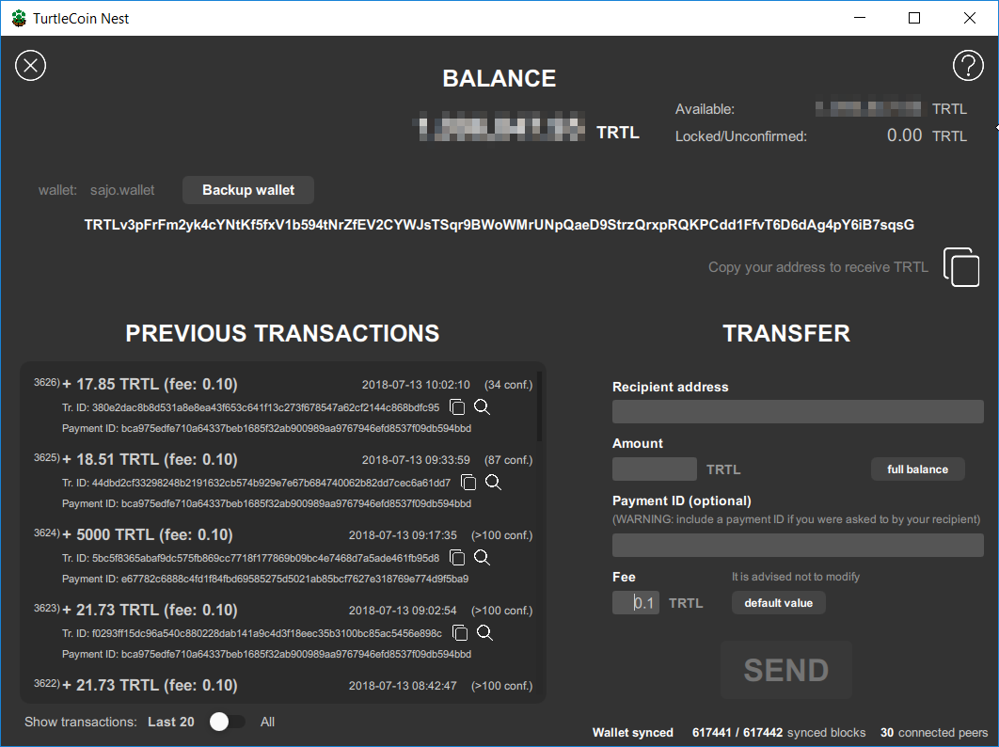
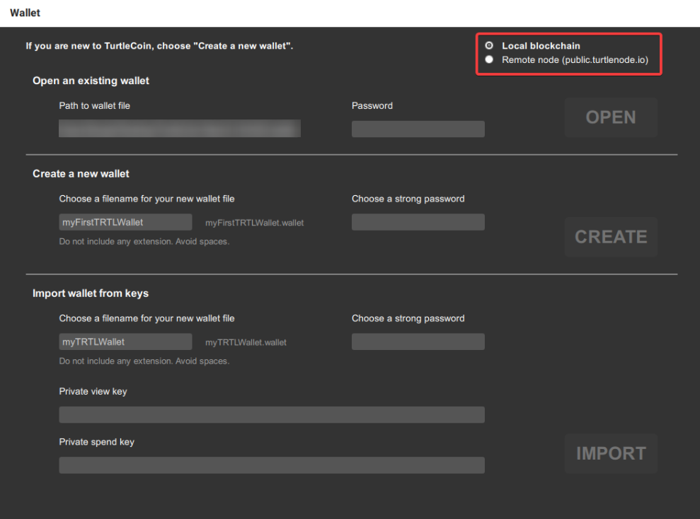
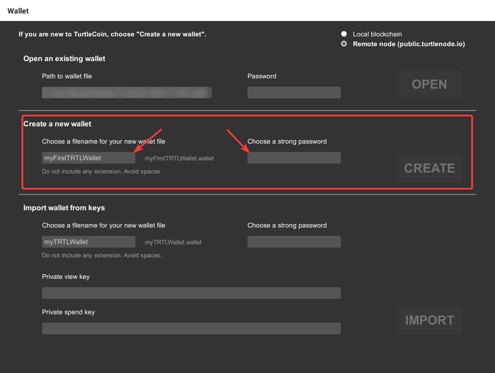
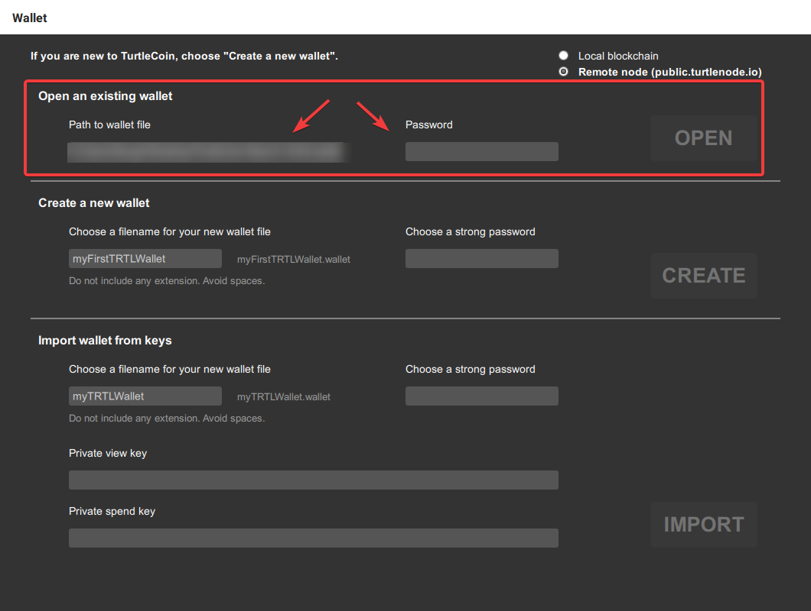
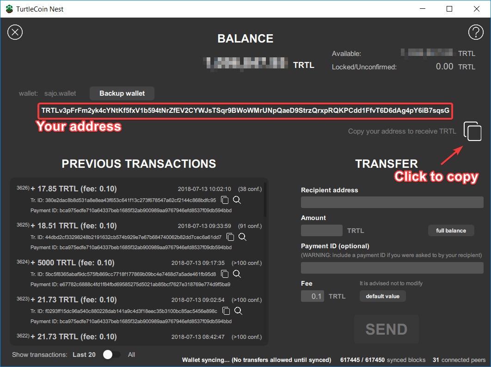
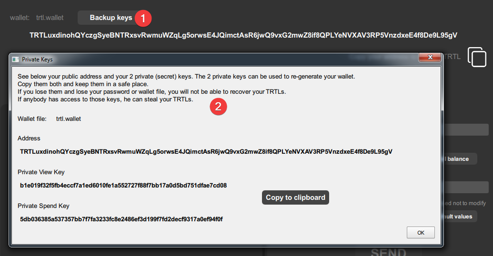
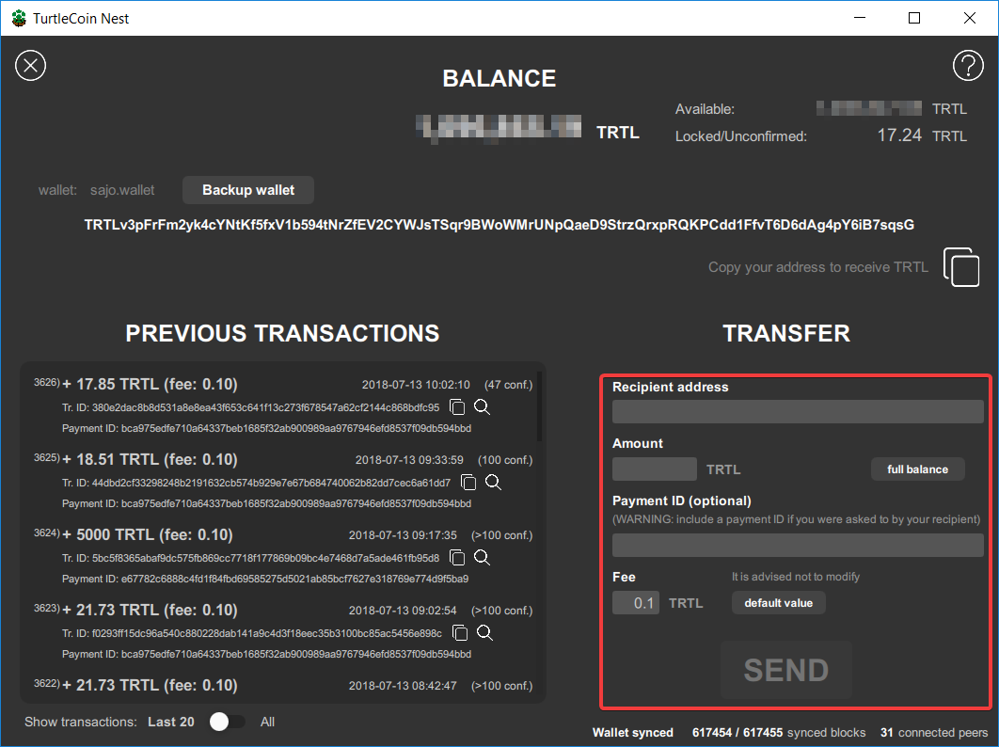
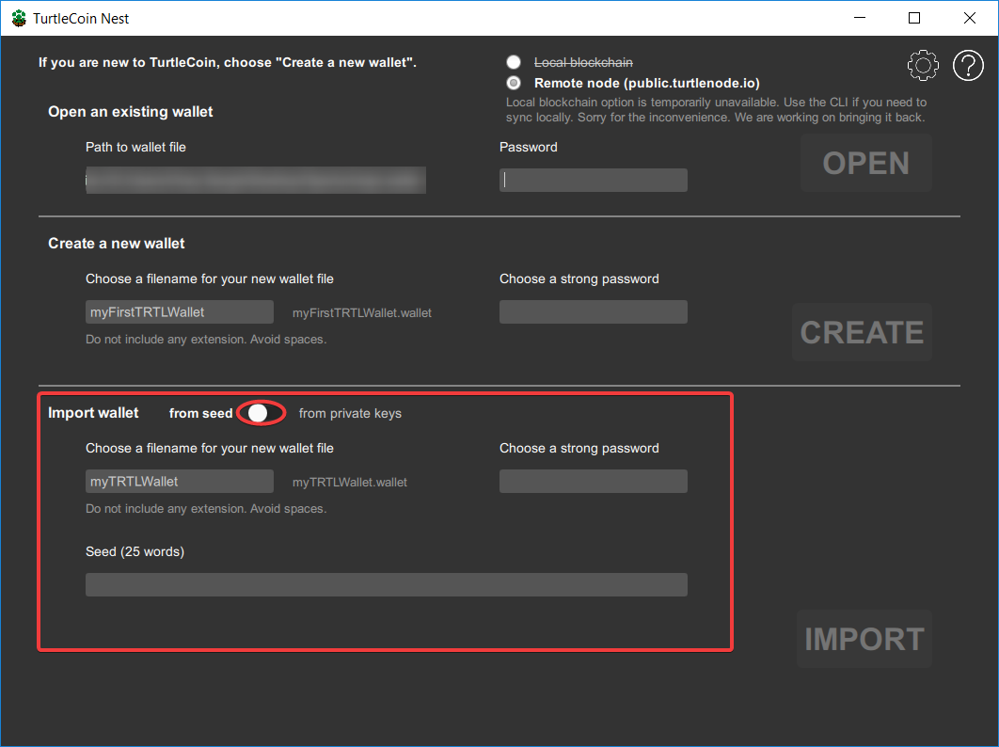

# Using Nest Wallet

## Screenshots

Here's a quick image of Nest Wallet in action-



## Downloading

Binary distributions can be found [here](https://github.com/turtlecoin/turtle-wallet-go/releases/latest).
Select the appropriate file for the target platform (Windows, Mac, Linux).

Windows and Mac binaries are provided in `.zip` format, while Linux binaries are provided in `.tar.gz` format.

## Installing

### Installing on Windows

Extract the `.zip` file (`TurtleCoin-Nest-x.xx-Windows.zip`).

### Installing on Mac

Extract the `.zip` file (`TurtleCoin-Nest-x.xx-Mac.zip`).

### Installing on Linux

Extract the `.tar.gz` file (`TurtleCoin-Nest-x.xx-Linux.tar.gz`).

```
tar -xzf TurtleCoin-Nest-x.xx-Linux.tar.gz
```


## Synchronizing the Blockchain

Nest Wallet automatically synchronizes from a remote node, ensuring that you quickly sync with the network and that excessive storage is not used up.

If you would rather sync from a local copy of the blockchain, select `Local blockchain` before opening your wallet.



## Using Nest Wallet

#### Windows

Run the `TurtleCoin-Nest.exe` executable from the extracted files.

#### Mac

Double click the app `TurtleCoin-Nest.app` from the extracted files.

If you have a blocking warning that says that this app comes from an unknown developer, right-click on the app, then click `Open > Open`.

#### Linux

```
./TurtleCoin-Nest.sh
```

### Creating a Wallet

Upon opening Nest Wallet, you will be greeted with a screen.

On the screen will be written `Create a new wallet`.



Under it will be a box into which you can type something.

Type what you want the name of your wallet to be. For example, `trtl`.


Next to it will be another box. In it, type a password to protect your wallet, and then confirm it.

 You will need to enter it every time you open the wallet. Make sure to choose a strong one!

Once done, press `CREATE`.

### Opening a Wallet

Upon opening Nest Wallet, you will be greeted with a screen.

On the screen will be written `Open an existing wallet`.



Under it will be a box.

Click on the box, File Explorer should open up. Navigate to where your `xyz.wallet` file is saved and open it.

Next to it, enter the password you set while making the wallet.

Once done, click `OPEN`.

### Viewing Wallet Address

Upon opening your wallet, your wallet address will be in the middle of the wallet screen. Press the button next to it to copy it to your clipboard.



### Exporting Keys

Each TurtleCoin  wallet is, essentially, just a pair of keys (*View Key* and *Spend Key*) from which the public address is derived.

It is **very** important to export these keys and back them up somewhere that is safe and secure (meaning somewhere reliable/permanent that no one else can access).

 In the event of a lost or corrupted wallet file, computer crash, etc., the **View Key** and **Spend Key** are the *only* way to restore a wallet and recover the funds it holds.

**DO NOT SHARE IT WITH ANYONE**. **Anyone who has these can *access your funds* and has *complete control* over your wallet.**

To back up your View Key and Spend Key, follow these steps-

* Click on `Backup wallet`

  

* Copy(click on `Copy to clipboard` to do it quickly) and safely store the `Private View Key` and `Private Spend Key`. You can register the wallet address with [trtlbot++](../Using-trtlbot-plus-plus#registering-your-wallet).

### Viewing Wallet Balance

Upon opening your wallet, your balance will be on the top of the wallet screen.


### Sending TurtleCoin Transactions

Upon opening your wallet, in the bottom right will be written `TRANSFER`.

To send a transaction, enter the recipient's address under `Recipient address`	and the amount you want to send under `Amount`.

Because transactions on the TurtleCoin blockchain are privatized, in
some situations a payment ID is necessary for the recipient to be able
to determine where the payment came from, for instance when depositing
to an exchange or other service.

Usually the service/recipient will generate and provide the required payment ID.

To include a Payment ID, simply enter it under `(optional) Payment ID`.



#### Changing the Fee

You can set the fee to any value which you want; however, the default value is `0.1` TRTL and it is not recommended to change it.

### Saving the Wallet

To safely close the wallet, simply close it as you normally would; by clicking the `X` at the top right/left, depending on your OS.

### Recovering Your Wallet

#### 25 Word Mnemonic Seed
If you want to recover your wallet with your 25 word mnemonic seed, it's pretty easy.

Upon opening Nest Wallet, *in the boxes under `Import wallet`*-

* enter the name you want to give your wallet
* enter the password you want to encrypt your wallet with
* enter your 25 word seed in the bottom box


#### Private View and Spend Keys

If you want to recover your wallet with your Private View and Spend Key, it is relatively easy.

Upon opening Nest Wallet, *in the boxes under `Import wallet`*-

* click on the circular button to change to the View/Spend key mode
* enter the name you want to give your wallet
* enter the password you want to encrypt your wallet with
* enter your View and Spend key in the bottom two boxes



Once done, click `IMPORT`. The wallet will be restored and begin syncing with the blockchain.
