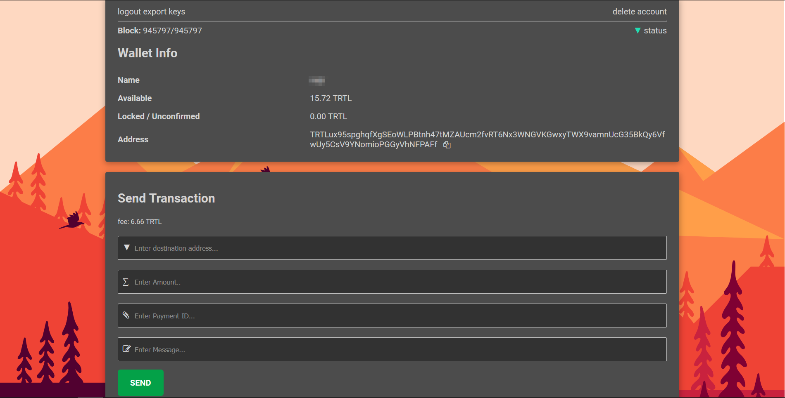
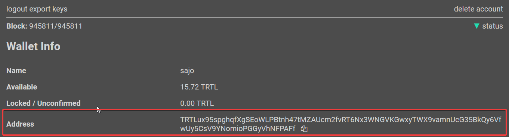
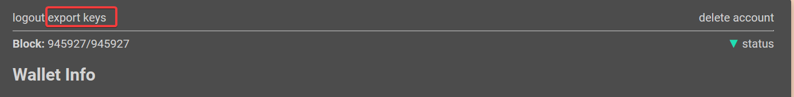
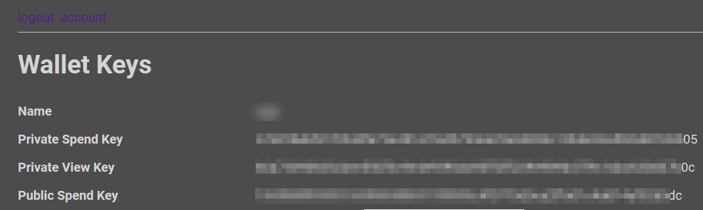
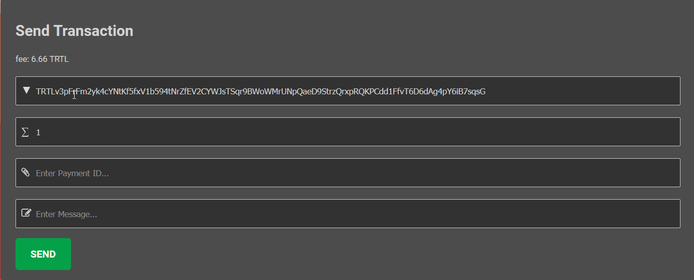
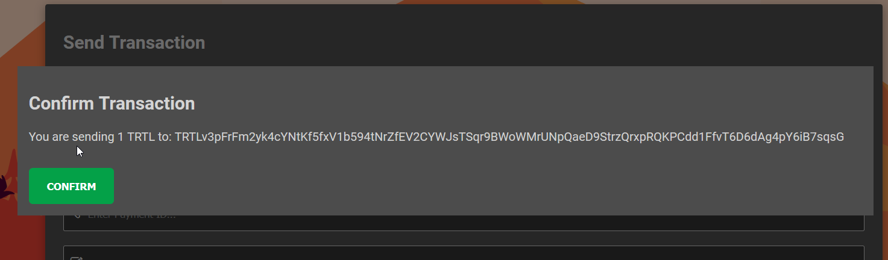
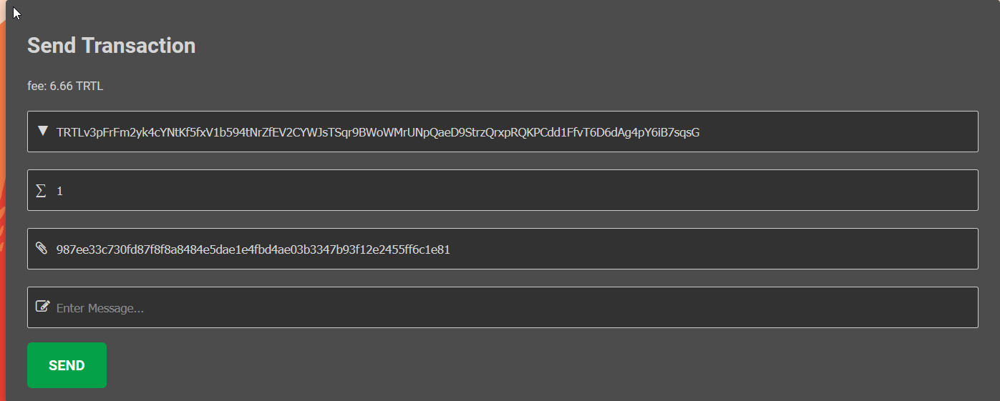
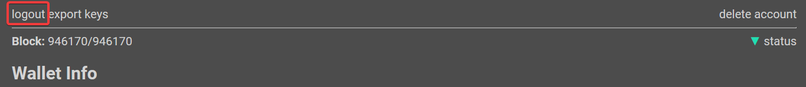
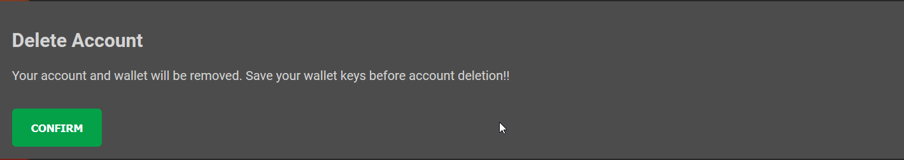

# Using Shellnet

## Screenshot

Here's a quick image of Shellnet in action:

## Using Shellnet

Because Shellnet is a web wallet, all you have to do is go to the [website](https://shellnet.pw) to interact with your wallet

## Creating a Wallet/Signing Up

To create a wallet, go to the [signup page](https://shellnet.pw/signup)  

Choose a username, and a strong, rememberable password to go along with it.  
If someone *gets access to this password*, they *get access to your funds on Shellnet*!  

## Opening a Wallet/Logging In

To login to your wallet, go to the [login page](https://shellnet.pw/login)

Enter the username and password you chose when signup up and press `LOGIN`: 

### Viewing Wallet Address

Your wallet's public address is available under `Wallet Info` next to `Address` on the home screen:

To copy it to your clipboard, press the small icon next to it.

### Exporting Keys

Each TurtleCoin  wallet is essentially, just a pair of keys (*View Key* and *Spend Key*) from which the public address is derived.
It is **very** important to export these keys and back them up somewhere that is safe and secure (meaning somewhere reliable/permanent that no one else can access).

In the event of a lost or corrupted wallet file, computer crash, etc., the *View Key* and *Spend Key* are the only way to restore a wallet and recover the funds it holds.

**DO NOT SHARE IT WITH ANYONE**. **Anyone who has these can *access your funds* and has *complete control* over your wallet.**

To view your keys, click on the `export keys` button in the top left.

Confirm your password when prompted

Your Private Spend and View key will now be displayed:

### Viewing Wallet Balance

Your wallet's balance is available under `Wallet Info` next to `Available` on the home screen

### Sending TurtleCoin Transactions

To send Turtlecoin; under `Send Transaction` on the home screen:

- Enter the address to whom you want to send some TRTL to

- Enter the amount of TRTL you want to send

- Enter the payment ID if the recipient has provided one. Check the [payment ID section](#tx-trtl-p-id) if you're not sure when/how to use it

- Enter an optional message to go along with it. If you'll be [tipping a Streamer](#tipping-a-streamer), this is highly recommended.

After that, click `SEND`

Verify that the amount and address are correct, and click `CONFIRM` to send; if something is amiss, press anywhere else to remove the dialogue.

*Know that there is a 6.66 TRTL fee charged by the web wallet*

Example:

#### Payment ID

Because transactions on the TurtleCoin blockchain are privatized, in some situations a payment ID is necessary for the recipient to be able to determine where the payment came from, for instance when depositing to an exchange or other service.

**You need it if you're sending TRTL to an exchange**.

To send a transaction with a payment ID, enter it in the `Enter Payment Id...` field

Note that typically, the service/recipient will generate and provide the required payment ID.

### Logging Out/Exiting the Wallet

To log out of Shellnet, simply click on the `logout` button on the top left on the home page

### Deleting your Account

To delete your account, click on the `delete account` button on the top right.

It confirm that you want to delete your account; [save your keys](#exporting-keys) before deleting your account so that you can access your TRTL again!  
To go ahead with deleting your account, press the `CONFIRM` button

After deleting, you will be redirected to the home page

### Recovering your Wallet

It is currently not possible to import your wallet in Shellnet, and is not planned.

### Tipping Streamers

Due to Shellnet's `Message` field, you can send tips to streamers with Shellnet, utilizing TwitchTurtle!

To learn more, check out [TwitchTurtle](https://twitchturtle.com)

To learn more about tipping streamers, and getting tipped if you are one, see [the docs](https://docs.twitchturtle.com).  
It's a very painless process and only takes a few minutes!
