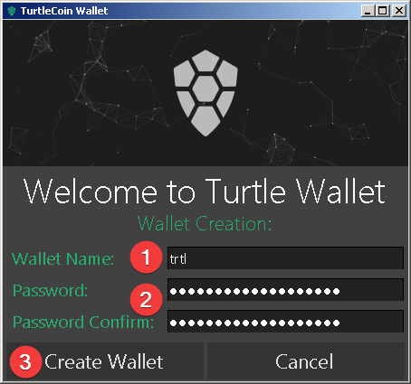
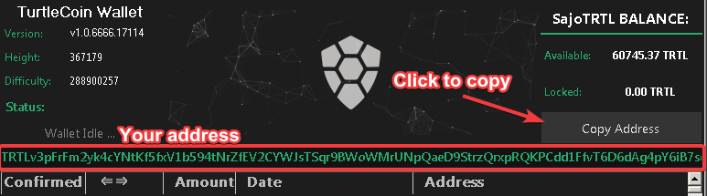
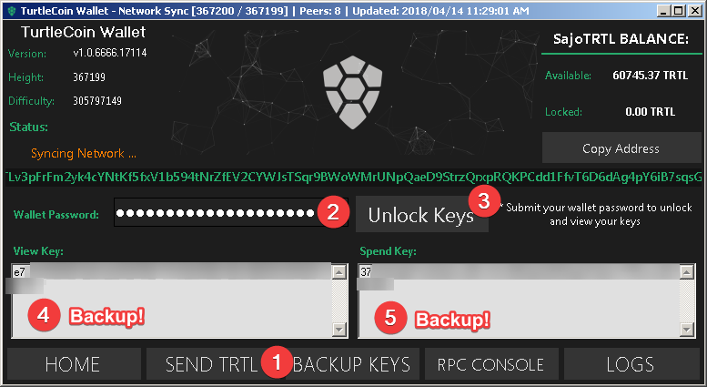
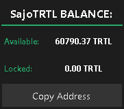

# Using WinForms Wallet

## Screenshots

Here's a quick image of WinForms wallet in action-

## Downloading

Binary distributions can be found [here](https://github.com/turtlecoin/turtle-wallet-winforms/releases/latest).

Select the appropriate file for the target platform (Windows, Mac, Linux). 

Binaries for Windows and Linux are both provided in the `.zip` format. Mac is currently not supported.

## Installing

### Installing on Windows

Extract the `.zip` file (`TurtleWallet_Windows_[version number].zip`).

### Installing on Linux

Right now, Linux is not supported.

### Installing on Mac

Right now, Mac is not supported.

## Synchronizing the Blockchain

Running `TurtleWallet.exe` will automatically open `walletd.exe` and begin synchronizing with the blockchain.

Because the blockchain is constantly growing, the file size is always increasing, and `TurtleCoind.exe` must verify each block (CPU intensive). 

To save time, consider downloading a cached 'bootstrap' of the blockchain (see [Bootstrapping the Blockchain](Bootstrapping-the-Blockchain) for more info).

## Using WinForms Wallet

### Windows

Run the `TurtleWallet.exe` executable from the extracted files.

### Linux

It is currently not supported.

### Mac

It is currently not supported.

### Creating a Wallet

Upon opening `TurtleWallet.exe`, you will be met with an opening screen. To create a new wallet, press `Create Wallet`.

After that, give your wallet a name (for example, `trtl`) and set a strong password (and confirm it).

Once done, click `Create Wallet`.

The wallet will then begin synchronizing with the blockchain. When done, it will open and you can access it's other features.

### Opening a Wallet

Upon opening `TurtleWallet.exe`, you will be met with an opening screen. To open a wallet, press `Select Existing Wallet`.

Then, navigate to where your `.wallet` file is saved through File Explorer and double-click.

After that, enter the password you set during creation and press `Submit`. 

The wallet will then begin synchronizing with the blockchain. When done, it will open and you can access it's other features.

### Viewing Wallet Address

Upon opening your wallet the address is in the middle of the page.

To copy it, you can click on the button which says `Copy Address`.

### Exporting Keys

Each TurtleCoin  wallet is, essentially, just a pair of keys (*View Key* and *Spend Key*) from which the public address is derived.

It is **very** important to export these keys and back them up somewhere that is safe and secure (meaning somewhere reliable/permanent that no one else can access). 

In the event of a lost or corrupted wallet file, computer crash, etc., the *View Key* and *Spend Key* are the only way to restore a wallet and recover the funds it holds.

**DO NOT SHARE IT WITH ANYONE**. **Anyone who has these can *access your funds* and has *complete control* over your wallet.**

To back up your keys, follow these steps-

* Upon opening your wallet, click `BACKUP KEYS`, located at the bottom of your wallet.

* Enter your wallet password and press `Unlock Keys`.

* Save your View Key and Spend key in a safe and secure place.

  

### Viewing Wallet Balance

Upon opening your wallet, your balance is located in the top right.

### Sending TurtleCoin Transactions

* Upon opening your wallet, in the bottom right will be written `SEND TRTL`, click it.
* To send a transaction, enter the recipient's address next to `Recipient`and the amount you want to send next to `Amount`.
* Because transactions on the TurtleCoin blockchain are privatized, in some situations a payment ID is necessary for the recipient to be able to determine where the payment came from, for instance when depositing to an exchange or other service.

​        Usually the service/recipient will generate and provide the required payment ID.

​        To include a Payment ID, simply enter it next to ` Payment ID`. *Note: It is optional, if it doesn't              give a payment ID it is most likely not required*

* Next is the `Mixin`, which is how many times your transaction will be mixed with others for obfuscation and privacy. The suggested amount is `3`.
* For the `Fee`, it is alright to leave it at `.1%`. If you send more than 1,000,000 TRTL at a time, it is best to set a fee of `1%`.

Once done, click `Send`.

### Saving the Wallet

To close the wallet safely, follow these steps-

* Click on the `X` on the top left/right, depending on your OS
* Click on `Yes` on the popup that appears.
* Click `OK` on the message which says `Saving the wallet, please wait`.

### Recovering your Wallet

#### Private View and Spend Keys

In case you want to recover your wallet with your View Key and Spend Key, it is relatively easy.

Upon opening `TurtleWallet.exe`, you will be met with an opening screen. To import a wallet, press `Import Wallet`.

- enter the name you want to give your wallet
- enter the password you want to encrypt your wallet with(and confirm it)
- enter your View and Spend key in the bottom two boxes
- Press `Import Wallet`

The wallet will then begin synchronizing with the blockchain. When done, it will open and you can access it's other features.

#### 25 Mnemonic Seed

View [this guide](Recovering-your-Wallet#25-winforms-wallet) for steps on recovering your wallet with your 25 word mnemonic seed.
