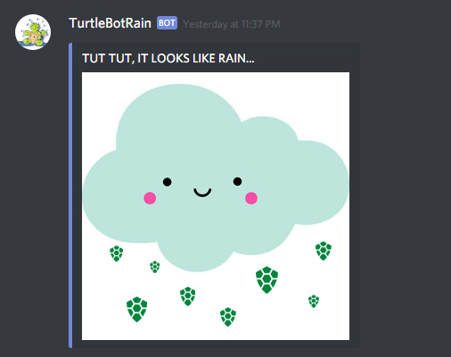
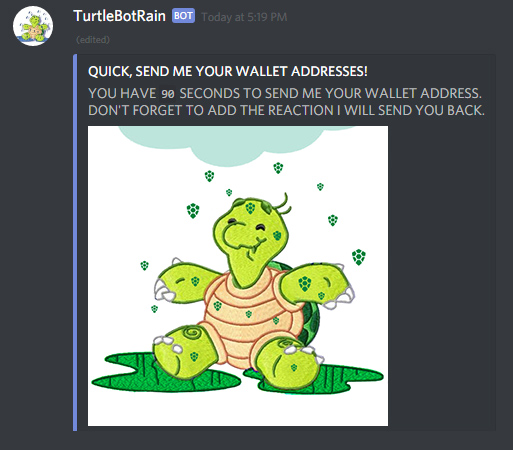
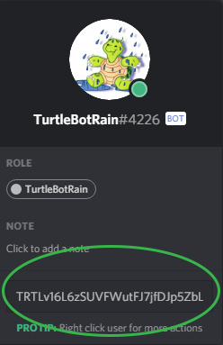
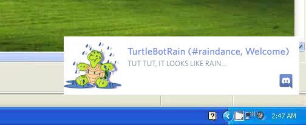
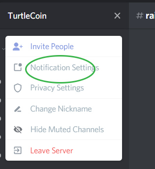
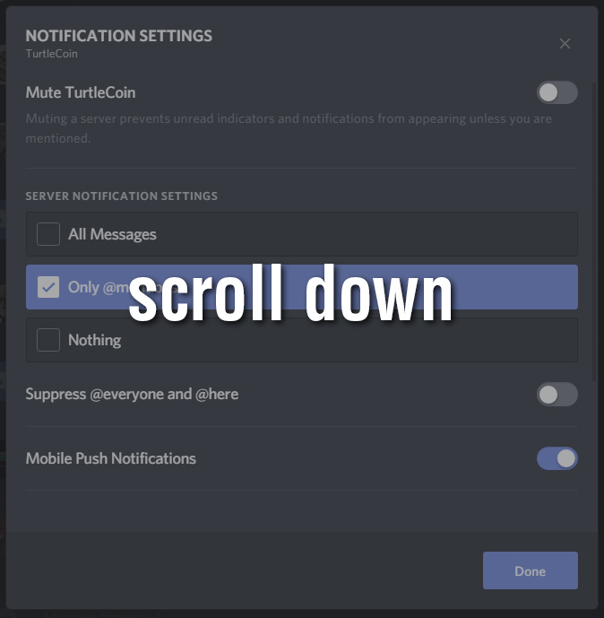

# How to Participate in a Raindance

This guide will walk you through the process.

## raindance

A raindance can happen when the TurtleBotRain wallet has acumulated 10,000 turtles.

When TurtleBotRain posts in the raindance channel it means a Raindance is about to begin!

When you see this message the RainDance will begin soon.
Get your TRTL wallet address ready.

**Wait** and especially **don't click on any reactions or emotes yet. This will cause a disqualification!**

Wait for the “Quick, send me your wallet” message.

Click on TurtleBotRain to send your address as a PM to TurtleBotRain.

You should recieve a PM back that looks like something like this:

or

**The Emoji will be different for everyone**

Now return to the raindance channel and react with the emoji you recieved in the PM.

Only click the emoji listed in the PM.

If you did everything correct you are included in the payout! Congrats!

## !rain

If you type !rain **in the bots channel only** you should get a response back with how many turtles are needed for a raindance.

## Notify

Enabling notifications for the raindance channel is easy.

Click the dropdown arrow.

Click on notification settings.

Scroll down.

Look for notification overrides.

Select "raindance".

Select "All".

Done.

-dylz
**TRTLv16L6zSUVFWutFJ7jfDJp5ZbLL5UzCfEPAczJeSodTG8Q7ZJeNFVab1dTL1eztEVcavf6frfnPhGHaZrwDfagJ1Eq4dt5ew**

-beezTEM (editor)
