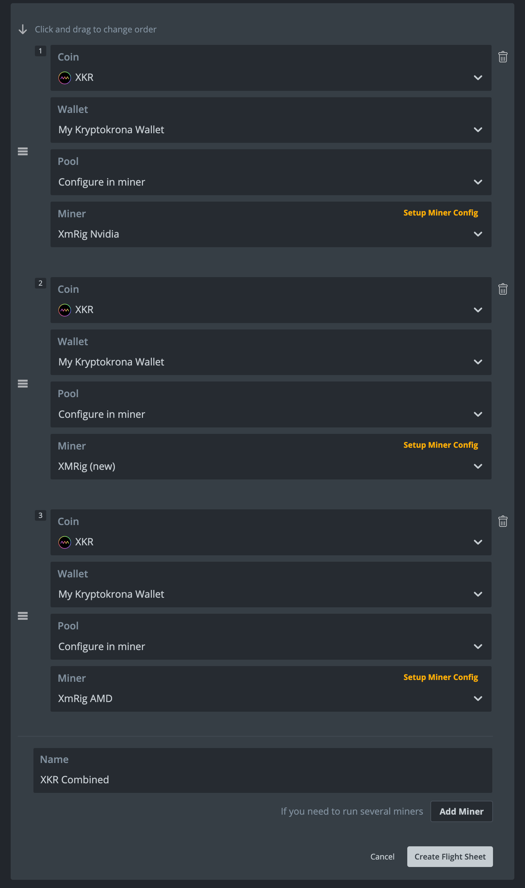

# 🍯 Mining on HiveOS

Before we begin, you need to make sure you have the following:

* A HiveOS account and a connected mining rig ([Click here for a guide on how to set this up](https://hiveon.com/knowledge-base/getting\_started/quick\_install/))
* A kryptokrona wallet ([Click here to generate one](https://explorer.kryptokrona.se/tools.html))

If you have fulfilled the requirements above, go to your HiveOS dashboard.

At your dashboard, click on your rig and then go to the Flight sheets screen:

<figure><figcaption>
The Flight Sheets screen
</figcaption></figure>

### Add wallet to HiveOS

Select XKR in the coins list, then click on **Add wallet** and enter you wallet details in the popup as shown below:

<figure><figcaption>
Wallet creation screen
</figcaption></figure>

Back at the flight sheet screen, pick "Configure in miner" in the Pool dropdown menu.

### Choose mining software

Which miner to use depends on what kind of hardware you're running on your miner, in the following sections we will go through setting up mining from CPUs, NVIDIA GPUs and AMD GPUS, as well as a combination of two or more of these.

* [CPU setup](mining-on-hiveos.md#cpu-mining-setup)
* [NVIDIA setup](mining-on-hiveos.md#nvidia-setup)
* [AMD setup](mining-on-hiveos.md#amd-setup)

### CPU mining setup

For CPU mining you want to use _XMRig (new)_ that you may find in the Miner dropdown menu, then click **Setup Miner Config**.

<figure><figcaption></figcaption></figure>

Below is a picture of the miner config screen, here you will need to choose `CryptoNight-Pico` as hash algorithm, enter  `%WAL%.%WORKER_NAME%` for Wallet template (or click **i** and then the text to copy it into the field automatically).&#x20;

In this example I'm using `pool.kryptokrona.se:7777` as my pool of choice, but it is possible to use any kryptokrona pool. You can find more information about the available pools here: [https://miningpoolstats.stream/kryptokrona](https://miningpoolstats.stream/kryptokrona)

Set password to `x` and enable CPU with the toggle. Also make sure the TLS setting is on or off based on your chosen pool and finally click **Apply changes**.

<figure><figcaption>
CPU Mining config with XMRig (new)
</figcaption></figure>

Now, for any additional GPU miners we have to click "Add miner" in the bottom right corner of the flight sheet config page and a new mining config field will pop up. Fill these in as you did [in this step.](mining-on-hiveos.md#add-wallet-to-hiveos)

### NVIDIA Setup

For NVIDIA we want to hit the **Add miner** button and fill out the form as shown below, if you've already created a wallet you can pick it in the list, otherwise add a new one. We also want to choose **XmRig Nvidia** for our miner. Next click **Setup Miner Config**.

<figure><figcaption>
A good looking NVIDIA setup
</figcaption></figure>

On the setup miner screen you need to enter `%WAL%.%WORKER_NAME%` under Wallet template, then pick a pool, such as `pool.kryptokrona.se:11898`, choose `x` for password and enter  `"algo": "cryptonight-pico"` under Config override. Finally click **Apply Changes.**

<figure><figcaption>
A fully configured XMRig NVIDIA
</figcaption></figure>

### **AMD Setup**

For AMD we want to hit the **Add miner** button and fill out the form as below, if you've already created a wallet you can pick it in the list, otherwise add a new one. We also want to choose **XmRig AMD** for our miner. Next click **Setup Miner Config**.

<figure><figcaption></figcaption></figure>

On the setup miner screen you need to enter `%WAL%.%WORKER_NAME%` under Wallet template, then pick a pool, such as `pool.kryptokrona.se:11898`, choose `x` for password and enter  `"algo": "cryptonight-pico"` under Config override. Finally click **Apply Changes.**

<figure><figcaption>
A fully configured AMD miner
</figcaption></figure>

## Save and start mining

Now you have your flight sheet that (depending on what kind of miner your setting up) looks a little something like this:

<figure><figcaption>
A miner running CPU + NVIDIA + AMD mining would look like this.
</figcaption></figure>

Now you want to click **Create Flight Sheet** and then activate it! Activate it by going to to your Dashboard -> Your Farm -> Your Worker -> Flight sheets. Then click the :rocket: button next to your newly created flight sheet to start mining XKR!&#x20;

<figure><figcaption>
Start flight sheet from here
</figcaption></figure>

If everything worked out, you should see the XKR badge with your hashrate on your HiveOS dashboard like in the image below:

<figure><figcaption>
Active hashrate on XKR
</figcaption></figure>

### Conclusion

If you want to track your mining you may do so on the pool's website that you picked. In the examples above I used https://pool.kryptokrona.se. Simply paste your XKR address into the "Check stats" field on the pools website to track your mining progress.

#### Need help?

Come and say hello on our [Discord](https://chat.kryptokrona.org).

Happy mining :tada:
