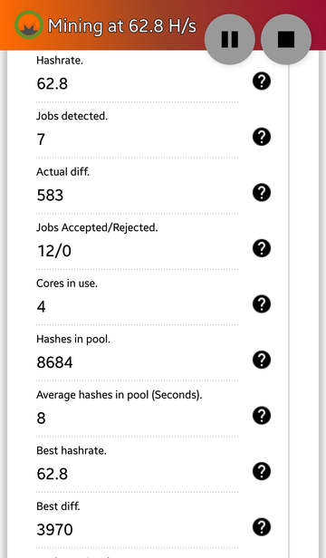

# Using Tony Monero

### Please note: Using your mobile to mine TurtleCoin is not effective and should only be done for the lulz. It may also cause the phone to overheat and result in premature silicon degradation, shortening the lifespan of your phone.

1.  Download the [Tony Monero](https://play.google.com/store/apps/details?id=com.ethics.path.tonymonero) app from the Google Play Store.
2.  Upon downloading and installing, open the app.
3.  Read through the agreement and accept/decline(which is the `EXIT` button). To use it, you will have to accept the agreement.
4.  Press the play button on the top right and wait for the application to test your device.
5.  If your device is supported, you will be brought to a screen with a success message.
6.  Check [Tony Monero Configuration](#tony-xmr-config)

*You should note that by using the Tony Monero app, you will be contributing 10% of your hashpower to the developer's wallet (while you are mining).*

## Tony Monero Configuration

1.  Leave `Profile selection` as default for now.
2.  Enter your TurtleCoin wallet address
3.  Enter a pool of your choice. To view a list of pools, you can go [here](../Pools)
4.  Enter the password of the pool. For most, it will be `x`
5.  Specify how many cores you want to use. We recommend using half of how many cores your phone has. So if your phone has 8 cores, enter `4`
6.  Click on the image with the three triangles (`<1<1<1`) and tap the 2nd image from the right on the top row, for TurtleCoin
7.  Make sure `Criptonight-lite support (Like AEON)` is checked.
8.  Press the play button on the top right

## Expected Results

The miner should now start mining, and the stats displayed show start updating, displaying your hashrate and the like(it may take a few minutes to update)

### Tony Monero

You can tap the question marks on the right if you're unsure of what each value means

Congratulations! You're now mining with your phone!

Feeling the lagginess yet? ;)
