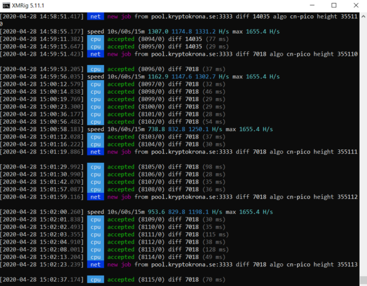
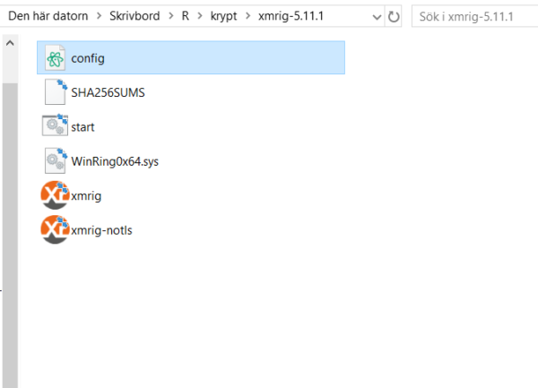
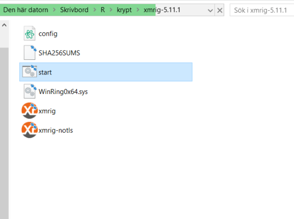

# ⛏ Get started with mining

<figure><figcaption>
XMRig mining kryptokrona on Windows
</figcaption></figure>

So you want to start mining XKR? Great! This is the place to start.

## Download

First order of business is to download the mining software, although there are many alternatives to choose between, we recommend XMRig.

Download XMRig here:

[Windows](https://github.com/xmrig/xmrig/releases/download/v5.11.1/xmrig-5.11.1-msvc-cuda10\_1-win64.zip)

[Linux](https://github.com/xmrig/xmrig/releases/download/v5.11.1/xmrig-5.11.1-xenial-x64.tar.gz)

_**Note to Windows users**_\
_Your antivirus software may react to the mining software, this is because viruses often download mining software to unknowing peoples PC's, hijacking their computer for unwanted mining. Just add a rule in your anti virus software to prevent this._ [_Here's a guide_](https://www.nicehash.com/blog/post/exclude-nicehash-miner-from-windows-defender-immediately)_._

## Configure

You need a config-file for the miner in order to mine. Generate one [here](https://www.kryptokrona.org/en/mining).

Don’t have a XKR address? Get one [here](https://explorer.kryptokrona.se/tools.html) (don't forget to save your mnemoic seed so you can access your funds with a wallet).

After you've generated your config.json file, place it into your XMRig folder.

<figure><figcaption>
Config file properly placed inside the XMRig-folder.
</figcaption></figure>

## Start the miner

Simply open **start** to start mining.

<figure><figcaption></figcaption></figure>

Congratulations!\
You’re mining!
--------------

Sit back and enjoy! Your computer is now generating XKR for you.

Got any issues? Visit our support-channel on [Discord](https://chat.kryptokrona.se/).

You can keep track on your mining progress from the pool's website.

Go to [MiningPoolStats.com ](https://miningpoolstats.stream/kryptokrona)to check out the statistics of the different mining pools and get access to their websites.

Happy mining!
