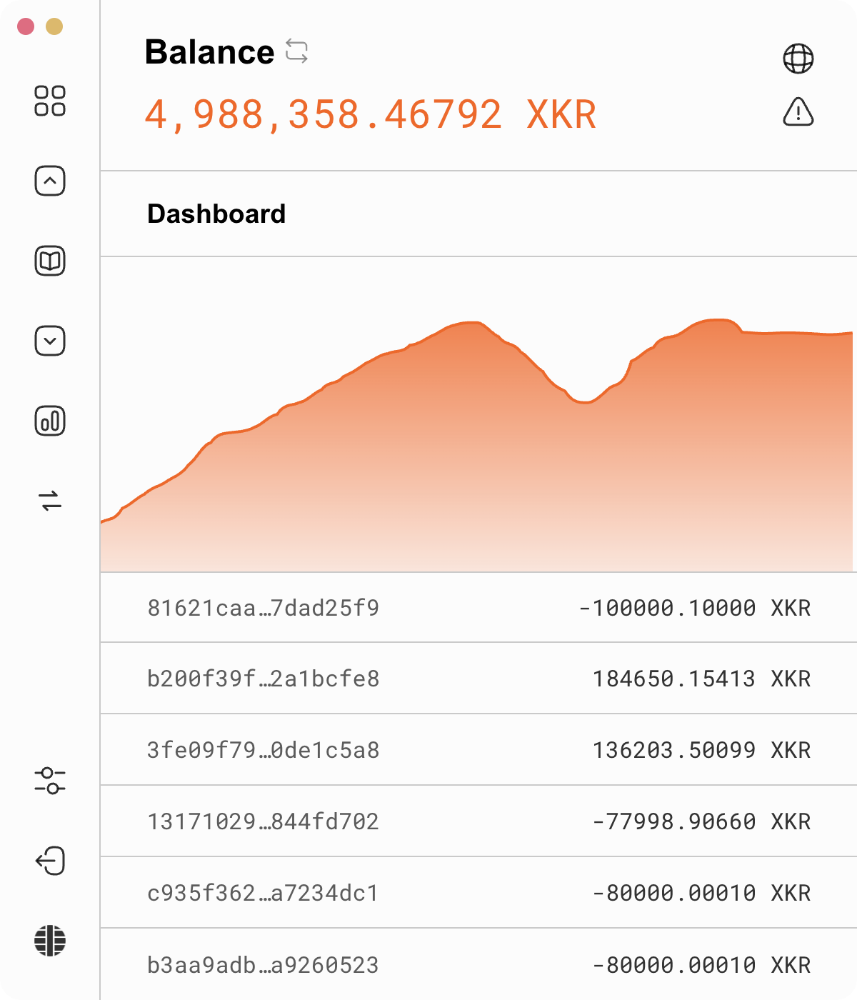
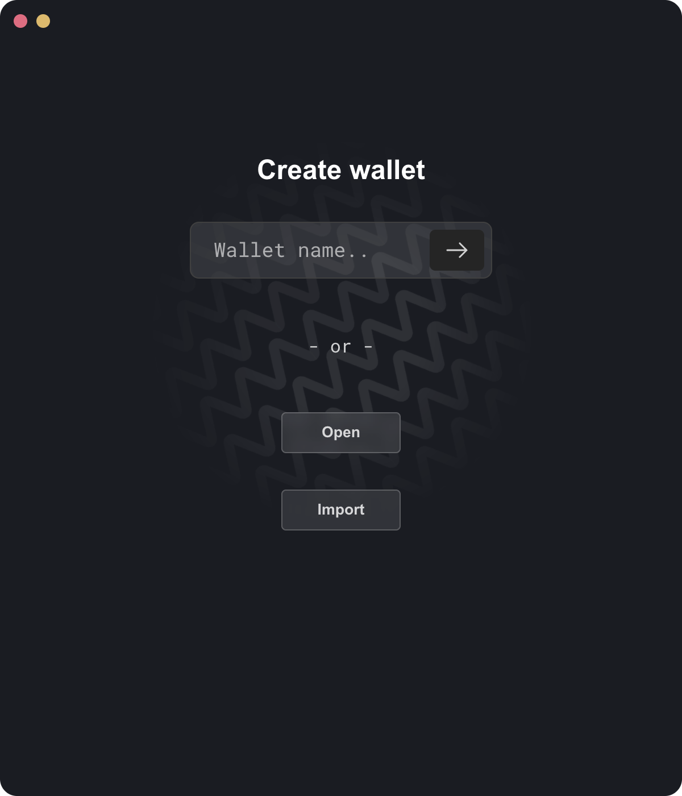

# Aesir Wallet

**Aesir** is the official Kryptokrona desktop wallet. It's a cross‑platform app (Windows, macOS, Linux) for managing your **XKR**, and it's the first wallet with built‑in, trustless **Bitcoin ⇄ XKR atomic swaps** — swap between BTC and XKR peer‑to‑peer, with no exchange, custodian, or wrapped tokens.

## Features

* **Send & receive XKR** with a clean, modern interface.
* **BTC ⇄ XKR atomic swaps** — buy or sell XKR for real Bitcoin directly from the wallet. See [Atomic Swaps](swaps.md).
* **Address book / contacts** for people you transact with often.
* **Fiat values** — see the USD (or your chosen currency) value of your XKR and BTC.
* **Node picker** — connect to any Kryptokrona node, or use the built‑in list.
* **Themes** and a few other quality‑of‑life touches.
* **Seed‑based** — your whole wallet, including the Bitcoin side used for swaps, is derived from your XKR wallet seed. Back up your seed and you've backed up everything.

## Download

Grab the latest build for your platform from the releases page:

**➡️ [Download the latest Aesir release](https://github.com/kryptokrona/aesir-wallet/releases/latest)**

| Platform | File to download |
| --- | --- |
| **Windows** | `Aesir Setup <version>.exe` (installer) |
| **macOS** (Apple Silicon) | `Aesir-<version>-arm64.dmg` |
| **macOS** (Intel) | `Aesir-<version>.dmg` |
| **Linux** | `Aesir-<version>.deb` |

> **macOS:** the app is code‑signed and notarized by Apple, so it opens normally.
>
> **Windows:** if SmartScreen warns about an unknown publisher on first run, choose **More info → Run anyway**. (Signed Windows builds are on the roadmap.)

## Getting started

1. Install and open Aesir.
2. **Create a new wallet** (or **import** an existing one with your seed).
3. **Write down your recovery seed** and store it offline — it's the only way to restore your funds.
4. Let the wallet sync with a node, and you're ready to send, receive, and swap.

## Next steps

* **[Atomic Swaps (BTC ⇄ XKR)](swaps.md)** — the headline feature: how it works, and step‑by‑step guides for both buying XKR with BTC (taker) and market‑making (maker).
